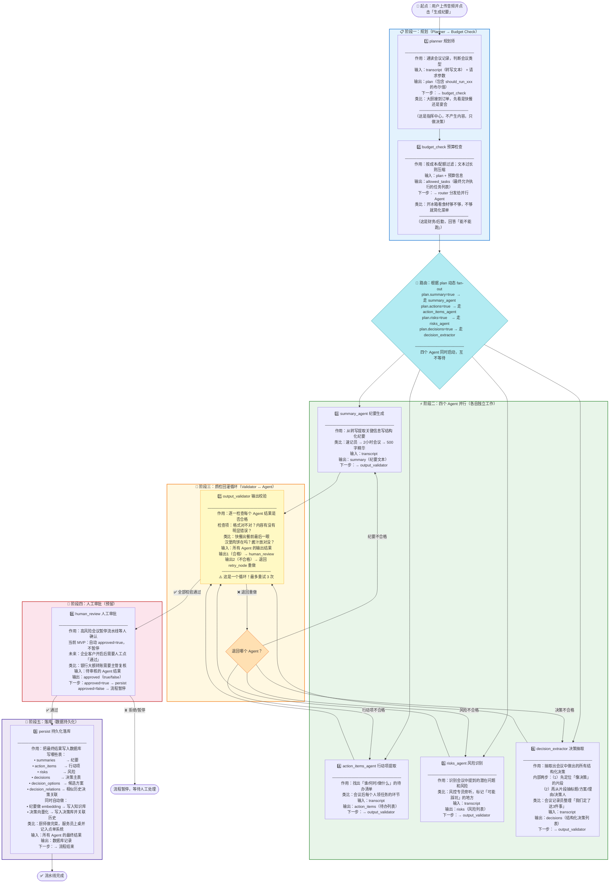
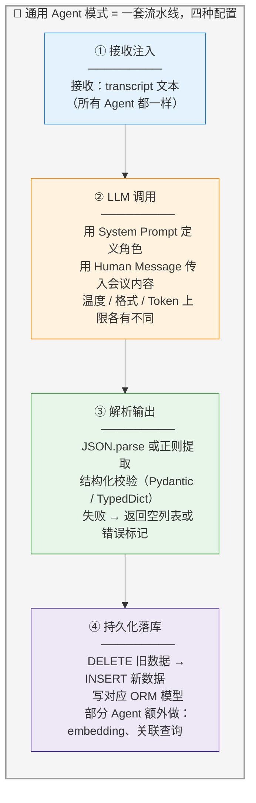
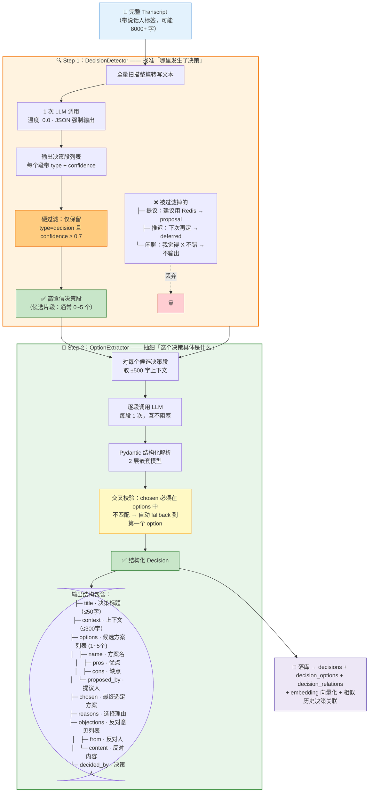
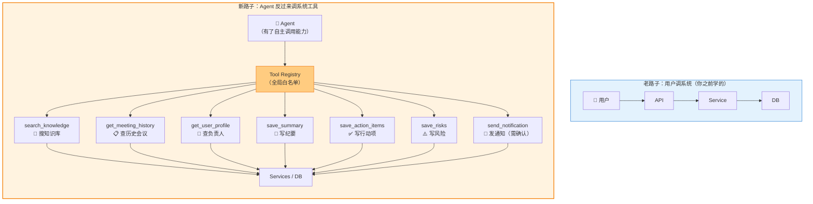

# MeetingAgent 零基础 Agent 学习与源码梳理指南

> 适合当前背景：会前端，后端/Python/Agent 基础薄弱。目标不是一次看懂全部源码，而是先抓住主线：这个项目解决什么问题、前后端如何协作、Agent/RAG/向量检索在代码里怎么落地。

## 1. 先给项目定性

`MeetingAgent` 的产品定位是一个面向研发评审会议的 AI 会议决策平台。

它的核心链路是：

```text
上传会议录音
  -> 后端保存音频
  -> DashScope ASR 或 Mock 转写
  -> 保存 Transcript
  -> LangGraph Multi-Agent 生成纪要、行动项、风险、决策
  -> 决策和知识内容向量化后写入 PostgreSQL + pgvector
  -> 前端展示会议、纪要、决策库、知识库、AI 对话、Agent 运行监控
```

一句话理解：这是一个把“会议内容”加工成“可检索知识和结构化决策”的全栈 Agent 应用。

## 3. 技术栈分层

## 4. 系统主架构

```text
Frontend React
  |
  | HTTP / File Upload / SSE
  v
FastAPI API Layer
  |
  v
Service Layer
  |-- MeetingService
  |-- TranscriptionService
  |-- SummaryService
  |-- DecisionGraphService
  |-- KnowledgeService
  |-- ChatService
  |
  v
Agent Layer / LangGraph
  |-- planner
  |-- budget_check
  |-- summary_agent
  |-- action_items_agent
  |-- risks_agent
  |-- decision_extractor
  |-- output_validator
  |-- human_review
  |
  v
Database
  |-- meetings
  |-- transcripts
  |-- summaries
  |-- action_items
  |-- risks
  |-- decisions
  |-- decision_options
  |-- decision_relations
  |-- knowledge_documents
  |-- agent_runs
  |-- chat_sessions / chat_messages
```

## 5. 后端源码阅读路线

建议按“入口 -> API -> Service -> Model -> Agent”的顺序读，不要一上来扎进 Agent。

### 第 1 站：后端启动入口

关键理解：

```text
main.py 创建 FastAPI app
  -> include_router(api_router)
  -> api/__init__.py 聚合 health / meetings / summaries / chat / knowledge / decisions / agent_runs / rooms
```

### 第 2 站：会议上传与转写链路

先读：

- `backend/app/api/meetings.py`
- `backend/app/services/meeting_service.py`
- `backend/app/services/transcription_service.py`
- `backend/app/models/meeting.py`
- `backend/app/models/transcript.py`

你要追踪这个流程：

```text
前端上传音频
  -> POST /api/meetings/{meeting_id}/upload
  -> meeting_service.save_audio()
  -> BackgroundTasks 调 transcription_service.transcribe_and_store()
  -> 写 transcripts 表
  -> 更新 meeting.status / transcription_mode
```

这里会遇到几个后端基础点：

- `UploadFile`：FastAPI 文件上传。
- `BackgroundTasks`：请求返回后继续跑后台任务。
- `AsyncSession`：异步数据库会话。
- `update(Meeting).where(...).values(...)`：SQLAlchemy 更新语句。
- `TRANSCRIPTION_PROVIDER=auto/mock/dashscope`：本地可用 Mock 跑通流程。

### 第 5 站：知识库与 RAG

先读：

- `backend/app/api/knowledge.py`
- `backend/app/services/knowledge_service.py`
- `backend/app/services/document_parser.py`
- `backend/app/services/document_chunker.py`
- `backend/app/services/embedding_service.py`
- `backend/app/models/knowledge_doc.py`

知识库链路：

```text
上传文档或写入会议纪要
  -> 文档解析
  -> 文本分块
  -> 批量 embedding
  -> 写 knowledge_documents
```

检索链路：

```text
用户问题
  -> query embedding
  -> pgvector 向量检索
  -> PostgreSQL 全文检索
  -> RRF 融合
  -> 简单 rerank
  -> 去重
```

你需要补的概念：

- `embedding`：把文本变成数字向量。
- `向量相似度`：用距离找语义相近内容。
- `RRF`：多个检索结果列表的融合排序方法。
- `chunk`：长文档切成小块，便于检索。

### 第 6 站：AI 对话

先读：

- `backend/app/api/chat.py`
- `backend/app/services/chat_service.py`
- `backend/app/models/chat.py`
- `frontend/src/api/chat.ts`
- `frontend/src/features/chat/hooks/use-chat.ts`
- `frontend/src/features/chat/pages/chat-page.tsx`

对话主链路：

```text
前端创建 chat session
  -> 用户发送问题
  -> POST /api/chat/sessions/{session_id}/stream
  -> chat_service.chat_stream()
  -> 保存用户消息
  -> 必要时改写查询
  -> knowledge_service.search()
  -> decision_graph_service.search()
  -> RRF 融合两路结果
  -> LLM stream=True
  -> 后端 SSE 返回 token
  -> 前端逐步渲染
  -> 保存助手回复
```

这部分对前端同学很重要，因为能把你熟悉的 UI 状态和后端 AI 流式接口连接起来。

重点看：

- 后端 `StreamingResponse` 如何返回 SSE。
- 前端 `ReadableStream` 如何解析 `data: ...`。
- `useStreamChat()` 如何维护 `isStreaming` 和 `streamingContent`。

### 前端请求模式

项目前端基本遵循：

```text
api/*.ts
  -> 定义 HTTP 请求
features/*/hooks/*.ts
  -> 用 TanStack Query 包装请求
features/*/pages/*.tsx
  -> 页面消费 hooks
components/*
  -> 纯 UI 或布局组件
```

比如会议模块：

```text
api/meetings.ts
  -> use-meetings.ts
  -> meeting-list-page.tsx / meeting-detail-page.tsx
```

## 7. SFU 模块先怎么理解

`sfu/` 是实时音视频服务，技术栈是：

- Node.js
- Express
- Socket.IO
- mediasoup

先读：

- `sfu/server.js`
- `sfu/lib/signaling.js`
- `sfu/lib/room.js`
- `backend/app/services/sfu_bridge.py`
- `backend/app/api/rooms.py`

第一阶段只需要知道：

- 它负责多人实时会议房间和媒体转发。
- 当前 README 里也标注了 MVP 未启用/预留。
- 它不是离线会议处理、Agent、RAG 的主链路。

所以学习优先级低于 `backend/app/services` 和 `backend/app/agents`。


### 数据库基础

你需要理解：

- 表、主键、外键、一对多关系。
- ORM 模型和数据库表的关系。
- migration 是什么。
- JSONB 为什么适合存 `reasons`、`objections`。
- pgvector 的 `Vector(1024)` 是向量列。

重点文件：

- `backend/app/models/*.py`

- `backend/alembic/versions/*.py`

- `backend/app/db/session.py`

- `backend/app/db/base.py`

  ### Day 5：数据库和模型

  目标：知道数据是怎么存的。

  读：

  - `backend/app/models/meeting.py`
  - `backend/app/models/transcript.py`
  - `backend/app/models/summary.py`
  - `backend/app/models/action_item.py`
  - `backend/app/models/risk.py`
  - `backend/app/models/decision.py`
  - `backend/app/models/knowledge_doc.py`

  练习：

  - 把 `Meeting -> Transcript -> Summary -> ActionItem/Risk/Decision` 关系画出来。
  - 看 Alembic migration 里表是如何创建的。

### RAG / 向量检索基础

你只要先掌握这条链：

```text
文本
  -> embedding model
  -> 向量
  -> 存入 pgvector
  -> 用户问题也向量化
  -> 找距离最近的内容
  -> 拼进 prompt
  -> LLM 回答
```

项目里两个 RAG 入口：

- 文档/纪要 RAG：`KnowledgeService`
- 决策 RAG：`DecisionGraphService`

最终由 `ChatService` 把两路结果合并给 LLM。

### Day 3：会议模块，从前端追到后端

目标：理解一个完整 CRUD + 上传文件链路。

读：

- `frontend/src/api/meetings.ts`
- `frontend/src/features/meetings/hooks/use-meetings.ts`
- `frontend/src/features/meetings/pages/meeting-detail-page.tsx`
- `backend/app/api/meetings.py`
- `backend/app/services/meeting_service.py`

练习：

- 画出“创建会议”和“上传音频”的调用链。
- 找到上传后为什么会自动触发转写。

### Day 6：转写链路

目标：理解 ASR 和 Mock 降级。

读：

- `backend/app/services/transcription_service.py`
- `backend/app/services/dashscope_asr_service.py`
- `backend/app/services/oss_service.py`

练习：

- 用 `TRANSCRIPTION_PROVIDER=mock` 跑通本地演示。
- 理解真实转写为什么需要 OSS：DashScope 需要公网可访问的音频 URL。


### Day 9：决策抽取

目标：理解项目最有业务特色的部分。

读：

- `backend/app/agents/nodes/decision_extractor.py`
- `backend/app/agents/nodes/decision_detector.py`
- `backend/app/agents/nodes/option_extractor.py`
- `backend/app/services/decision_graph_service.py`
- `frontend/src/features/decisions/pages/decision-list-page.tsx`
- `frontend/src/features/decisions/pages/decision-detail-page.tsx`

练习：

- 用一段会议转写文本手动判断哪些句子是“决策”。
- 对照代码看 LLM 输出会如何变成 `Decision` / `DecisionOption`。

### Day 10：知识库

目标：理解文档上传、解析、分块、向量化。

读：

- `backend/app/api/knowledge.py`
- `backend/app/services/knowledge_service.py`
- `backend/app/services/document_parser.py`
- `backend/app/services/document_chunker.py`
- `frontend/src/features/knowledge/pages/knowledge-page.tsx`

练习：

- 上传一个小文档。
- 搜索关键词，观察结果。
- 找到搜索同时使用“向量检索”和“全文检索”的代码。

### Day 11：RAG 对话

目标：理解 AI 对话不是裸 LLM，而是检索增强。

读：

- `backend/app/services/chat_service.py`
- `backend/app/api/chat.py`
- `frontend/src/api/chat.ts`
- `frontend/src/features/chat/hooks/use-chat.ts`
- `frontend/src/features/chat/pages/chat-page.tsx`

练习：

- 追踪 `streamChat()` 从前端发送到后端 SSE 返回。
- 找出 `doc_results` 和 `decision_results` 是在哪里融合的。
- 理解系统提示词 `SYSTEM_PROMPT` 如何使用检索结果。


### Day 14：做一个小改动

目标：通过改代码巩固理解。不要一上来改 Agent prompt 或数据库结构，先从前端展示和普通 API 字段开始。

推荐小任务：

- 给会议详情页增加一个“转写模式”的更明显展示。
- 给决策列表增加一个 confidence 筛选。
- 给知识库搜索结果展示 source_type。
- 给 AgentRun 列表增加失败原因摘要。

## 10. 必读文件清单

### 第三优先级

- `sfu/server.js`
- `sfu/lib/signaling.js`
- `sfu/lib/room.js`
- `backend/app/api/rooms.py`
- `backend/app/services/sfu_bridge.py`

## 12. 如何高效读一个功能

以后遇到任何功能，都按这个路径追：

```text
页面按钮/交互
  -> features/*/pages/*.tsx
  -> features/*/hooks/*.ts
  -> frontend/src/api/*.ts
  -> backend/app/api/*.py
  -> backend/app/services/*.py
  -> backend/app/models/*.py
```

如果功能涉及 AI，再继续追：

```text
services/*.py
  -> agents/meeting_graph_v2.py
  -> agents/nodes/*.py
  -> agents/harness/*.py
```

如果功能涉及检索，再继续追：

```text
services/embedding_service.py
services/knowledge_service.py
services/decision_graph_service.py
models/knowledge_doc.py
models/decision.py
```

### 模型 5：决策库是这个项目的业务亮点

普通会议助手只做纪要；这个项目进一步把“评审决策”结构化、向量化、关联历史决策，这是更垂直的 Agent 应用。


## 16. 最小闭环验收清单

当你能完成下面这些，就说明你已经从“完全陌生”进入“能参与开发”的状态：

- 能启动前端、后端、数据库。
- 能创建会议并上传音频。
- 能解释 Mock 转写和真实转写的区别。
- 能找到会议详情页对应的前端页面、hook、API 文件。
- 能找到 `/api/meetings`、`/api/summaries`、`/api/chat` 的后端实现。
- 能解释 `SummaryService.generate_summary()` 的主流程。
- 能画出 `meeting_graph_v2` 的节点图。
- 能解释决策如何从转写文本进入 `decisions` 表。
- 能解释知识库检索为什么同时用向量和全文。
- 能解释 AI 对话为什么叫双路 RAG。
- 能做一个小的前端展示改动，并知道是否需要改后端 API。

## 18. 通俗理解 Agent 流水线

### 配套 Mermaid 流程图（带全节点注释）

下面这张图把表格中的信息全部"画"了出来，每个节点都标注了：**作用、输入、输出、下一步、日常类比**。建议配合上方表格一起看。



### 回答新手最常见的 3 个疑问

**Q：为什么要有 planner，直接跑所有 Agent 不行吗？**

短期会议或者非正式讨论，可能不需要抽行动项和决策。planner 根据会议内容判断"这场会值得跑哪些 Agent"，避免浪费 Token 和时间。就像一个经验丰富的助理，先判断"老板只是聊聊天"还是"正式评审会"再决定要不要做会议纪要。

**Q：budget_check 和 planner 有什么区别，为什么是两个节点？**

planner 回答"应该跑什么"——基于会议内容做语义判断。budget_check 回答"能不能跑"——基于成本和配额做工程判断。比如 planner 说"需要跑全量分析"，但 budget_check 发现 Token 余额不足，就会压缩文本或裁减 Agent。两者分工不同：一个做内容决策，一个做资源调度。

**Q：四个 Agent（summary, actions, risks, decisions）之间为什么不互相通信？**

它们各干各的，互不依赖：
- summary 写纪要不需要知道 risks 抽出了什么风险
- decision_extractor 不需要等其他 Agent 的结果

这样设计的好处是：任何一个 Agent 失败或重试，不影响其他 Agent 的进度。如果它们互相依赖，一个挂了会导致全部卡住。最终由 validator 统一检查所有结果的一致性就够了。

## 19. 横向对比：四个 Agent 本质上是同一个模式的四种实例

上一节的表格告诉你每个节点"做什么"，这一节拉远镜头，让你看清它们的本质：**Summary、Action Items、Risks、Decisions 四个 Agent，核心都遵循同一套工程流水线，只是在每个环节的参数不同而已。**

### 先看"同一套流水线"长什么样



### 落差最大的一张对比表

这个表把四个 Agent 在流水线每个环节的差异一字排开。你会看到：前三列长得像亲兄弟，第四列（Decision）是它们的大哥——做的事情比别人多一个量级。

| 对比维度 | Summary | Action Items | Risks | Decisions |
|---------|---------|-------------|-------|-----------|
| **LLM 调用次数** | 1 次 | 1 次 | 1 次 | **1 + N 次**（N = 检测到的片段数） |
| **输出类型** | 单段文本（Markdown） | 扁平数组（4 字段） | 扁平数组（3 字段） | **深层嵌套**（10+ 字段，2 层嵌套） |
| **温度参数** | 0.3 | 0.3 | 0.3 | **0.0**（识别阶段要求完全确定性） |
| **超时时间** | 60s | 60s | 60s | **120s**（两步流水线，翻倍） |
| **解析方式** | 正则提取 key_points | JSON.parse → TypedDict | JSON.parse → TypedDict | **Pydantic BaseModel**（带嵌套子模型） |
| **置信度机制** | 无 | 无 | 无 | **LLM 自评 + 0.7 硬阈值过滤** |
| **多阶段处理** | 无 | 无 | 无 | **两步管线：detect → extract** |
| **LLM 客户端** | LangChain | LangChain | LangChain | **原生 AsyncOpenAI**（更底层控制） |
| **响应格式控制** | 自由文本 | JSON 约束 | JSON 约束 | `response_format: json_object` |
| **落库表数** | 1 张（summaries） | 1 张（action_items） | 1 张（risks） | **3 张**（decisions + options + relations） |
| **会议关系** | 1:1（强制 FK） | 1:N（强制 FK） | 1:N（强制 FK） | 1:N（可空 FK，支持跨会议） |
| **向量索引** | 无 | 无 | 无 | **pgvector Vector(1024)**（语义检索用） |
| **跨会议知识** | 无 | 无 | 无 | **相似决策关联**（decision_relations 表） |
| **失败隔离** | 错误进 errors[] | 返回空列表 | 返回空列表 | **外层 try/except**，决策失败不阻塞纪要生成 |

### 你应该建立的直觉

**直觉 1：四个 Agent 是一个抄了四遍的模板**

打开代码对比 `summary_agent`、`action_items_agent`、`risks_agent` 三个函数，你会发现它们长得几乎一模一样：

```text
def xxx_agent(state) -> dict:
    # 1. 从 state 拿 transcript_text
    # 2. 构造 system + human prompt
    # 3. 调 LLM
    # 4. 解析返回结果
    # 5. 写回 state
```

唯一的区别就是 prompt 内容不同、解析字段不同。这是刻意设计的：**团队先搭了一套"Agent 模板"，然后用不同 prompt 实例化出三个功能。** 等你以后自己开发 Agent 应用，也应该是先写一个 Agent 跑通，再 cv 出第二个、第三个。

**直觉 2：Decision 是这个模板的"升级版"**

当产品需求比"填个字段"更复杂时，简单模板不够用了：
- 需要先检测再提取（两步管线）
- 需要置信度过滤（不是所有输出都可信）
- 需要向量索引（后续要搜索决策）
- 需要关联历史（跨会议的知识）

所以 Decision Extractor 在模板基础上往上叠了一层复杂度，但它"注入 transcript → 调 LLM → 解析 → 落库"的核心骨架没变。这就是为什么说它是"升级版"，不是重构版。

## 20. 深入理解：Decision Extractor 为什么必须拆成两步？

前面讲过，四个 Agent 里 Decision Extractor 最特殊——它是唯一一个用了"两步流水线"的。这一节单独拆开它，回答一个关键问题：**为什么不一步到位，直接让 LLM 从整篇转写文本里生成决策？**

### 先看"一步到位"为什么不行

如果用一个 LLM 调用直接完成：

```text
完整 Transcript → 一个 Prompt → 结构化 Decision 列表
```

会遇到两个致命问题：

1. **混入噪声**：会议转写里"提议但未确定"、"推迟到下次"、"随口聊一句"的话很多，LLM 很可能把这些也当决策抽出来。
2. **长文本丢失细节**：8000 字的转写文本，LLM 容易只记住开头和结尾，中间的关键决策段被忽略（这就是大模型的"上下文窗口中间丢失"问题）。

### 两步流水线的设计逻辑



### 拆成两步的核心收益

用真实会议场景的一句话说明区别：

```text
张三：我建议用 Redis。（这是提议，不是决策）

张三：那就这么定了，这一期使用 Redis。（这才是真正的决策）
```

如果一步到位，LLM 很容易把第一句也当成决策抽出来，因为它确实"提到了技术选型"。

拆成两步后：
- **Step 1（找准）** 通过 Prompt 中明确的正/反例定义（见 `DETECTOR_PROMPT`），要求 LLM 区分 `decision`（已拍板）、`proposal`（提议未定）、`deferred`（推迟），只保留置信度 ≥ 0.7 的纯决策段。
- **Step 2（抽细）** 只在确认是决策后才进入结构化抽取，此时输入不再是整篇转写，而是"一段已确认的决策 + 前后 500 字上下文"。LLM 可以专注于提取标题、选项、理由等细节，不需要同时判断"这是不是决策"。

换句话说：**Step 1 做的是选择题（是/不是决策），Step 2 做的是填空题（决策的具体内容）**。把选择题和填空题分开，每个任务的准确率都比合在一起高。

### 代码怎么体现？

在 `decision_extractor_node` 中，两步是显式串联的：

```40:76:/Users/zhihu/Desktop/myStudy/MeetingAgent/backend/app/agents/nodes/decision_extractor.py
        # Step 1: 全量扫描定位决策段
        segments = await detect_decisions(transcript)
        if not segments:
            logger.info("[decision_extractor] 未识别到决策段")
            return {"decisions": []}

        # Step 2: 逐段抽取结构化选项
        decisions: list[dict] = []
        ...
        for seg in segments:
            try:
                extracted = await extract_options(seg, transcript)
                if extracted:
                    decision_dict = extracted.model_dump(by_alias=True)
                    ...
                    decisions.append(decision_dict)
            except Exception as e:
                # 单个段抽取失败不影响其他段
                logger.warning(...)
```

三个关键设计点：

1. **按段循环**：`for seg in segments` —— Step 1 找出 N 个段，Step 2 就跑 N 次，每次处理一个段。
2. **失败隔离**：单个段的 `extract_options` 出错只 `continue`，不影响其他段。一个决策抽失败了，其他的照常产出。
3. **整体兜底**：整个 `decision_extractor_node` 被包在一层 `try/except` 里，如果全局失败就返回 `{"decisions": []}`，不阻塞同一轮的其他 Agent（纪要、行动项、风险照常生成）。

### Step 1 的过滤逻辑

在 `detect_decisions` 中，硬过滤发生在 LLM 返回之后：

```103:108:/Users/zhihu/Desktop/myStudy/MeetingAgent/backend/app/agents/nodes/decision_detector.py
    # 过滤：只保留 decision 且 confidence >= 0.7
    filtered = [s for s in segments if s.type == "decision" and s.confidence >= 0.7]
    logger.info(
        f"[DecisionDetector] 识别 {len(segments)} 段，过滤后 {len(filtered)} 段"
    )
    return filtered
```

比如 LLM 返回了 8 段（3 个决策 + 2 个提议 + 1 个推迟 + 2 个低置信），最终只保留约 2~3 个高质量决策段进入 Step 2。

### Step 2 的交叉校验

`extract_options` 在解析完 JSON 后，会做一次关键校验：`chosen` 必须等于 options 中某个 `name`，否则不合法：

```147:155:/Users/zhihu/Desktop/myStudy/MeetingAgent/backend/app/agents/nodes/option_extractor.py
    # 校验：chosen 必须等于 options 中某个 name
    option_names = [opt.name for opt in decision.options]
    if decision.chosen not in option_names:
        logger.warning(
            f"[OptionExtractor] chosen={decision.chosen!r} 不在 options={option_names}，"
            f"自动取第一个 option 作为 chosen"
        )
        if decision.options:
            decision = decision.model_copy(update={"chosen": decision.options[0].name})
```

这是 LLM 输出的一个常见坑：LLM 可能写出 `"chosen": "Redis"`，但 options 里写的是 `"name": "使用 Redis 缓存"`，字符串不完全匹配。这段代码自动把 `chosen` fallback 到第一个 option，防止后续落库时报错。

### 一句话总结

> **Step 1 负责"有没有决策"（召回 + 过滤），Step 2 负责"决策是什么"（结构化 + 校验）。把判断型任务和抽取型任务分开，比用一个 LLM 调用来回做两件事的准确率高得多。**

## 21. 双路 RAG：用户问 AI 时，系统去哪找答案？

前面所有章节讲的都是"生成会议纪要"的链路（上传音频 → 转写 → Agent 并行分析 → 落库）。这一节讲的是另一个场景：**纪要已经生成完了，用户打开 AI 对话，问了一个问题**。

### 场景还原

用户打开聊天页面，打字：

> "我们之前为什么选择 Redis？"

这时候系统做的事情和"生成纪要"完全不一样——它不是在分析一篇新的会议记录，而是在**已经存好的知识库和决策库里翻找相关信息**，然后让 LLM 基于找到的内容回答。

### 为什么不能直接让 LLM 回答？

如果直接把这个问句丢给 LLM，它会凭"训练时见过的知识"回答，而不是基于你们团队的会议记录。它会说 Redis 的一般优点，但说不出你司上次评审会的真实讨论和拍板理由。

所以系统需要先"翻资料"，再把翻到的内容作为上下文喂给 LLM。这就是 RAG（Retrieval-Augmented Generation，检索增强生成）的核心思想：

> **LLM 负责"说得好"，RAG 负责"说得对"。**

### 为什么叫"双路"？

因为系统搜索了**两个不同的数据源**：

| 路 | 数据源 | 负责服务 | 存的是什么 | 检索方式 |
|----|--------|----------|-----------|----------|
| 路 1 | 知识库 | `KnowledgeService` | 会议纪要 + 上传的文档（分块向量化） | 向量检索 + 全文检索 → 内部 RRF 融合 → rerank → 去重 |
| 路 2 | 决策库 | `DecisionGraphService` | 结构化历史决策（带 pgvector 索引） | pgvector 余弦距离语义检索 |

两路是**并行发起的**，各自搜各自的，互不等待。

### 全链路 Mermaid 流程图

```mermaid
flowchart TD
    Q["💬 用户提问<br/>「我们之前为什么选择 Redis？」"]

    Q --> rewrite

    subgraph PRE["🔁 预处理：查询改写"]
        rewrite["查询改写 _rewrite_query()
        ——————————————————
        如果问题很短且含指代词（它/这个/那个），
        先让 LLM 把「它」还原成具体内容
        例：「它的截止日期？」→「上线Redis的截止日期？」
        ──────────────────
        如果问题明确且长，跳过这步"]
    end

    rewrite --> split

    split{"🔀 双路并行检索<br/>（同时发起，互不等待）"}

    subgraph PATH1["📚 路1：知识库（KnowledgeService.search）"]
        direction TB
        p1_start["收到查询文本"]
        p1_start --> p1_embed["查询向量化（embedding）"]
        p1_embed --> p1_vec["向量检索（pgvector 余弦相似度）<br/>召回 top_k × 2 条"]
        p1_embed --> p1_full["全文检索（PostgreSQL ts_vector）<br/>召回 top_k × 2 条"]
        p1_vec --> p1_rrf["内部 RRF 融合<br/>合并两路排名 → 统一排序"]
        p1_full --> p1_rrf
        p1_rrf --> p1_top["取 top_k 条"]
        p1_top --> p1_rerank["Rerank 重排序<br/>（基于关键词匹配加分）"]
        p1_rerank --> p1_dedup["去重（相似度 > 0.7 的块只留一条）"]
        p1_dedup --> p1_out["📤 输出：top-3 文档结果<br/>每条含 title / content / score"]
    end

    subgraph PATH2["📊 路2：决策库（DecisionGraphService.search）"]
        direction TB
        p2_start["收到查询文本"]
        p2_start --> p2_embed["查询向量化（embedding）"]
        p2_embed --> p2_search["pgvector 余弦距离检索<br/>找语义最接近的 top-3 决策"]
        p2_search --> p2_out["📤 输出：top-3 决策结果<br/>每条含 title / context / chosen_option / score"]
    end

    split --> PATH1
    split --> PATH2

    p1_out --> rrf
    p2_out --> rrf

    subgraph MERGE["🔄 RRF 跨来源融合（chat_service._rrf_fuse）"]
        direction TB
        rrf["RRF 公式：score = 1 ÷ （60 + 排名）
        ——————————————————
        • 文档路结果按 doc:{id} 记分
        • 决策路结果按 decision:{id} 记分
        • 按融合分降序重排 → 取 top-5
        ──────────────────
        作用：把两个不同排行榜合并成一个大排行榜
              你不需要关心「k=60」的具体含义"]
    end

    rrf --> context

    subgraph BUILD["📝 构建 LLM 上下文"]
        direction TB
        context["按来源区分格式：
        ──────────────────
        [1] 来源：决策库 - 采用Redis缓存
            已选方案：Redis
            背景：讨论了本地缓存 vs Redis...

        [2] 来源：会议纪要 - 第3次技术评审
            内容：经讨论决定使用Redis作为...

        [3] 来源：文档 - 缓存方案对比
            内容：Redis 支持持久化和集群...
        ──────────────────
        每条标注来源类型，限制文本长度"]
    end

    context --> prompt

    subgraph GENERATE["🤖 LLM 流式生成"]
        direction TB
        prompt["拼接 System Prompt：
        ──────────────────
        「你是 AI 会议助手...
        当前检索结果：
        {context}
        ...
        优先使用知识库和决策库中的内容回答」
        ──────────────────
        把检索结果嵌入到提示词中"]
        prompt --> llm["流式调用 LLM
        temperature: 0.7 · stream: true"]
        llm --> sse["SSE 逐字推送给前端"]
    end

    sse --> FRONTEND(["💬 前端流式渲染回答
    「根据会议纪要和历史决策记录，
    你们选择 Redis 的主要原因有三点...」"])

    style Q fill:#e3f2fd,stroke:#1976d2
    style PRE fill:#f3e5f5,stroke:#9c27b0
    style PATH1 fill:#e8f5e9,stroke:#388e3c,stroke-width:2px
    style PATH2 fill:#fff3e0,stroke:#f57c00,stroke-width:2px
    style MERGE fill:#ffebee,stroke:#c62828,stroke-width:2px
    style BUILD fill:#e0f2f1,stroke:#00796b
    style GENERATE fill:#e8eaf6,stroke:#3949ab
    style FRONTEND fill:#c8e6c9,stroke:#2e7d32
    style split fill:#b2ebf2,stroke:#00838f
```



### 用大白话解释 RRF

两路检索都返回了各自认为最相关的结果，但问题来了：**它们各自的"第一名"，哪个更有资格排在整个系统的第一名？**

RRF（Reciprocal Rank Fusion，倒数排名融合）做的事很简单：

```text
路1 说：文档A 排第1 → 得分 = 1/(60+1) = 0.0164
路2 说：决策B 排第1 → 得分 = 1/(60+1) = 0.0164
路1 说：文档C 排第2 → 得分 = 1/(60+2) = 0.0161
...

最后按得分从高到低排，取前 5 条。
如果同一条在两路都出现了，分数会叠加，排名自然更靠前。
```

你不用理解 `k=60` 这个常数为什么是 60（这是学术界验证过的经验值），只需要知道：**RRF 的作用就是把两个排行榜合并成一个，排名越靠前的结果得分越高。**

### 代码怎么体现？

在 `chat_service.chat_stream()` 中，双路 RAG 的核心只有这几行：

```151:165:/Users/zhihu/Desktop/myStudy/MeetingAgent/backend/app/services/chat_service.py
        # 4. 双路 RAG 检索（文档 + 决策）+ RRF 融合
        try:
            doc_results = await knowledge_service.search(db, rewritten_query, top_k=3)
        except Exception as e:
            logger.warning(f"知识库检索失败: {e}")
            doc_results = []

        try:
            decision_results = await decision_graph_service.search(db, rewritten_query, top_k=3)
        except Exception as e:
            logger.warning(f"决策库检索失败: {e}")
            decision_results = []

        # RRF 融合两路结果（跨来源统一排序）
        fused = self._rrf_fuse(doc_results, decision_results, top_k=5)
```

三个关键设计：
1. **两路并行**：`knowledge_service.search()` 和 `decision_graph_service.search()` 都是 async 的，各自独立执行，互不阻塞。
2. **各自容错**：每一路包了独立的 `try/except`，知识库挂了不影响决策路结果（反之亦然），用户至少能从一边拿到答案。
3. **统一融合**：`_rrf_fuse` 接收两路结果，按 RRF 公式算出融合排名，取 top-5 作为最终上下文。

### 检索结果怎么变成 LLM 的上下文？

融合后的 top-5 结果被格式化成带来源标注的文本块：

```168:190:/Users/zhihu/Desktop/myStudy/MeetingAgent/backend/app/services/chat_service.py
        if fused:
            context_parts = []
            for i, r in enumerate(fused, 1):
                source_type = r.get("source_type", "")
                if source_type == "decision":
                    title = r.get("title", "未知决策")
                    chosen = r.get("chosen_option")
                    context_text = r.get("context", "")
                    parts = [f"[{i}] 来源：决策库 - {title}"]
                    if chosen:
                        parts.append(f"已选方案：{chosen}")
                    if context_text:
                        parts.append(f"背景：{context_text[:400]}")
                    context_parts.append("\n".join(parts))
                else:
                    source = "会议纪要" if source_type == "meeting_summary" else "文档"
                    context_parts.append(
                        f"[{i}] 来源：{source} - {r.get('title', '未知')}\n"
                        f"内容：{r.get('content', '')[:500]}"
                    )
            context = "\n\n".join(context_parts)
        else:
            context = "（未检索到相关知识或决策）"
```

注意细节：
- 决策库结果用 `title + chosen_option + context(截断400字)` 格式
- 文档/纪要结果用 `title + content(截断500字)` 格式
- 每条前面都有 `[序号] 来源：xxx`，所以 LLM 回答时能自然地引述来源
- 如果两路都没搜到东西，上下文就是 `（未检索到相关知识或决策）`，LLM 会基于通用知识回答但会说明

### 知识库内部还有"子 RRF"

你可能注意到流程图里，路 1 的知识库 `search()` 内部又多了一层 RRF：

```text
knowledge_service.search()
  ├─ 向量检索（pgvector 余弦相似度）
  └─ 全文检索（PostgreSQL ts_vector）
  → RRF 融合 → rerank → 去重
```

这是知识的两种互补找法：
- **向量检索**：找"意思相近"的内容。你问"缓存方案"，它能找到提到"Redis"的文档，即使没出现"缓存"这个词。
- **全文检索**：找"关键词匹配"的内容。直接搜"Redis"，精确匹配。

两者 RRF 融合后，在知识库内部就得到了一份高质量结果，再和决策路的结果做第二次 RRF 融合。

### 一句话总结

> **双路 RAG = 一条路翻会议纪要和文档（知识库），一条路翻历史决策（决策库），两路并行搜、RRF 合并排、top-5 喂给 LLM。LLM 负责表达好，RAG 负责信息准。**

## 22. Agent 的分叉口：Tool Registry 与 meeting_ops

前面所有章节讲的流程是：

```text
用户 → API → Service → Agent Pipeline → 落库
```

这是"系统调 Agent 干活"的链路。Agent 被动接受任务，按图执行，输出结果。

但 `main.py` 里有一行很不起眼的代码，指向了另一条路：

```12:13:/Users/zhihu/Desktop/myStudy/MeetingAgent/backend/app/main.py
# 启动时触发 Tool Registry 注册（副作用 import）
import app.agents.tools.meeting_ops  # noqa: F401
```

这行代码的意思是：**应用启动时，不是等用户调 API 才注册工具，而是主动 import `meeting_ops`，让它里面的工具自动注册到一个全局注册表里。**

这就是 Agent 项目和普通 CRUD 项目开始分叉的地方。普通项目的关系是：

```text
用户 → API → Service → DB
```

但这里的关系多了一层"Agent 可以反过来调用工具"：



### 三个核心概念拆开讲

#### 概念 1：Tool Registry 是什么？

一个**全局白名单字典**，存在内存里。Agent 想调用任何工具，必须先在这个白名单里查——不在名单里的，一律拒绝。

```42:43:/Users/zhihu/Desktop/myStudy/MeetingAgent/backend/app/agents/tools/registry.py
# 全局工具注册表
TOOL_REGISTRY: dict[str, ToolSpec] = {}
```

每个工具被定义为一个 `ToolSpec`（工具规格），包含：

```30:39:/Users/zhihu/Desktop/myStudy/MeetingAgent/backend/app/agents/tools/registry.py
@dataclass
class ToolSpec:
    """工具规格定义"""
    name: str
    risk: ToolRisk
    description: str
    handler: Callable[..., Awaitable[Any]]
    requires_confirmation: bool = False
    timeout_seconds: int = 30
    max_retries: int = 1
```

类比：Tool Registry 就像公司门禁系统。每个员工（工具）都有工牌（ToolSpec），刷卡（注册）后才能进门。没工牌的陌生人，安保系统直接拒绝。

#### 概念 2：meeting_ops 是什么？

`meeting_ops.py` 是**具体工具的集合文件**。里面用装饰器 `@register_tool(...)` 把一个个 Python 函数注册进注册表。

它目前注册了 **7 个工具**，按安全等级分成三档：

| 工具名 | 安全等级 | 做什么 | 类比 |
|--------|----------|--------|------|
| `search_knowledge` | READ_ONLY（只读） | 搜企业知识库 | 助理翻文件柜找资料 |
| `get_meeting_history` | READ_ONLY（只读） | 查同主题历史会议 | 翻过去的会议记录 |
| `get_user_profile` | READ_ONLY（只读） | 查负责人的任务完成率 | 查同事的OKR |
| `save_summary` | WRITE_SAFE（安全写） | 保存纪要 | 助理把纪要归档 |
| `save_action_items` | WRITE_SAFE（安全写） | 保存行动项 | 更新待办清单 |
| `save_risks` | WRITE_SAFE（安全写） | 保存风险 | 更新风险看板 |
| `send_notification` | WRITE_DANGER（危险写） | 发邮件/IM 通知 | **助理群发邮件，需要主管签字** |

每个工具的注册方式完全一样，以 `search_knowledge` 为例：

```35:52:/Users/zhihu/Desktop/myStudy/MeetingAgent/backend/app/agents/tools/meeting_ops.py
@register_tool(ToolSpec(
    name="search_knowledge",
    risk=ToolRisk.READ_ONLY,
    description="检索企业知识库，返回与 query 最相关的文档片段",
    handler=None,  # 装饰器会自动赋值
    timeout_seconds=15,
))
async def search_knowledge(query: str, top_k: int = 5) -> dict:
    """检索企业知识库"""
    from app.services.knowledge_service import knowledge_service
    async with async_session_factory() as db:
        results = await knowledge_service.search(db, query, top_k=top_k)
        return {"query": query, "results": results, "total": len(results)}
```

装饰器 `@register_tool(...)` 做的事：**把下面这个函数，连同它的名称、风险等级、超时限制、描述一起存进全局 `TOOL_REGISTRY` 字典。**

#### 概念 3：为什么启动时要 `import meeting_ops`？

Python 有一个特性：当一个模块被 `import` 时，模块里的**顶层代码**会立即执行。

`meeting_ops.py` 的顶层有 7 个 `@register_tool(...)` 装饰器。当 `main.py` 执行 `import app.agents.tools.meeting_ops` 时，这 7 个装饰器全部跑一遍，7 个工具全部注册进 `TOOL_REGISTRY`。

所以 `main.py` 里的那行 import 不是在"用"工具，而是在"激活"工具。它让整个应用一启动就准备好了整套工具白名单，后续 Agent 想调哪个随便调。

### Tool Registry 的四级安全模型

这是本项目最精妙的设计之一——不是所有工具 Agent 都能随便调：

```mermaid
flowchart LR
    subgraph LEVELS["Tool Registry 四级安全模型"]
        direction TB
        L1["🟢 READ_ONLY（只读）
        ─────────────────
        例：search_knowledge
             get_meeting_history
             get_user_profile
        ─────────────────
        规则：任意 Agent 直接调用
              不需要人工确认
              超时 5~15 秒"]

        L2["🔵 WRITE_SAFE（安全写）
        ─────────────────
        例：save_summary
             save_action_items
             save_risks
        ─────────────────
        规则：任意 Agent 直接调用
              不需要人工确认
              但被限制为"只写自己的数据"
              超时 10 秒"]

        L3["🟠 WRITE_DANGER（危险写）
        ─────────────────
        例：send_notification
        ─────────────────
        规则：Agent 可以提议调用
              但必须人工确认后才执行
              requires_confirmation=True
              超时 15 秒"]

        L4["🔴 SYSTEM（系统级）
        ─────────────────
        例：（当前未注册）
              导出数据、发全公司通知
        ─────────────────
        规则：默认禁用
              需管理员手动开启"]
    end

    style L1 fill:#c8e6c9,stroke:#2e7d32
    style L2 fill:#b3e5fc,stroke:#0277bd
    style L3 fill:#ffe0b2,stroke:#ef6c00
    style L4 fill:#ffcdd2,stroke:#c62828
```

代码里危险操作被拦截的逻辑：

```94:101:/Users/zhihu/Desktop/myStudy/MeetingAgent/backend/app/agents/tools/registry.py
    # 危险操作需要人工确认
    if requires_confirmation_check and spec.requires_confirmation:
        approved = await _check_human_approval(agent_run_id, name)
        if not approved:
            msg = f"工具 {name} 未获人工批准"
            logger.warning(f"[ToolRegistry] {msg}")
            duration_ms = int((time.time() - started_at) * 1000)
            await _record_tool_call(agent_run_id, name, kwargs, None, duration_ms, "denied", msg)
            return {"ok": False, "result": None, "error": msg, "duration_ms": duration_ms}
```

### 这个设计解决什么问题？

没有 Tool Registry 的世界：Agent 代码里直接写 `await knowledge_service.search(...)`，所有调用散落在各个 Agent 节点的函数里。出问题时你不知道哪个 Agent 调了哪个 Service，也无法统一管控（超时、重试、权限、审计日志全得手搓）。

有了 Tool Registry 之后：

| 能力 | 没有 Registry | 有 Registry |
|------|-------------|------------|
| **权限控制** | 靠开发者自觉不乱调 | 四级安全模型硬约束 |
| **超时保护** | 每个调用自己写 `asyncio.wait_for` | 注册时声明，自动套 |
| **重试策略** | 零散 try/except | 统一重试，超时不重试 |
| **审计日志** | 需要每个 Agent 手动记录 | `_record_tool_call` 统一写 AgentRun |
| **白名单** | 无 | 未注册工具直接拒绝 |
| **前端可发现** | 不知道有什么工具可用 | `GET /api/agent-runs/tools/list` 列出所有工具 |

最后一点特别重要：前端可以调这个 API 看到当前系统注册了哪些工具、各自的安全等级。这让 Agent 的运行状态对用户透明——用户知道 Agent 能干什么、不能干什么。

### 当前状态：工具已就位，等待"Agent 自主调用"

严格来说，当前的 Agent Pipeline（`meeting_graph_v2`）**还没有用到 `call_tool` 来让 Agent 自主选工具**。每个 Agent 节点仍然是通过固定的 Service 调用完成任务（比如 `summary_agent` 直接调 LLM 生成纪要，不需要 `call_tool("save_summary", ...)`）。

但 Tool Registry 的架构已经全部搭好了：

```text
main.py import → 工具注册 ↑ ✅ 已完成
registry.py → call_tool / 安全模型 ↑ ✅ 已完成
meeting_ops.py → 7 个具体工具 ↑ ✅ 已完成
GET /api/agent-runs/tools/list → 前端可见 ↑ ✅ 已完成

Agent 自主调用 call_tool ↓ ❌ 未来功能
```

未来的方向是：Agent 不再是"按固定图执行"，而是**拿到一个任务后，自己决定要调哪些工具、以什么顺序调**。比如：

```text
Agent 收到任务：「帮我整理这次评审会的纪要并通知相关人员」

Agent 的思考：
  1. 先调 get_meeting_history 看看有没有同主题的历史会议参考格式
  2. 调 search_knowledge 搜一下相关背景资料
  3. 自己写纪要
  4. 调 save_summary 保存
  5. 调 save_action_items 保存行动项
  6. 调 send_notification 通知行动项负责人 ← 这一步需要人工确认！
```

当项目走到这一步时，它就从一个"自动化流水线"进化成了"自主 Agent"。


### 一句话总结

> **Tool Registry 是 Agent 的"工具箱白名单"。meeting_ops 往里面放了 7 个工具（3 个只读 + 3 个安全写 + 1 个危险写）。所有工具调用都经过统一入口 `call_tool()`，享受超时保护、重试、安全分级、审计日志。目前工具已就位，等未来 Agent 学会"自己选工具干活"。**

