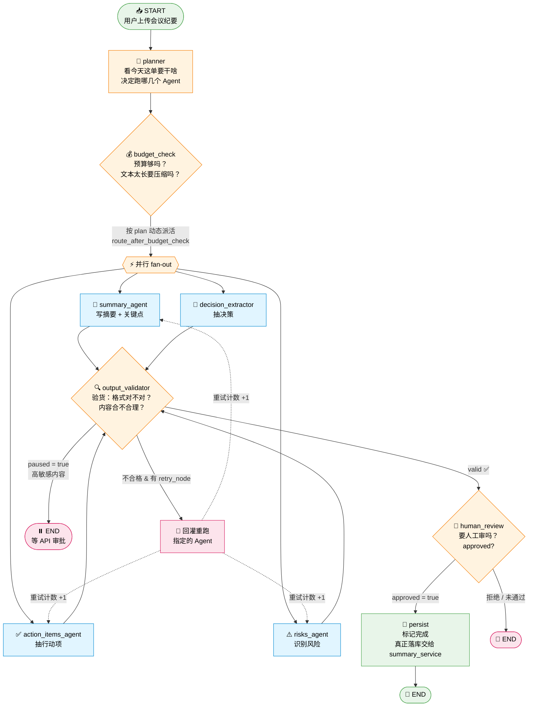
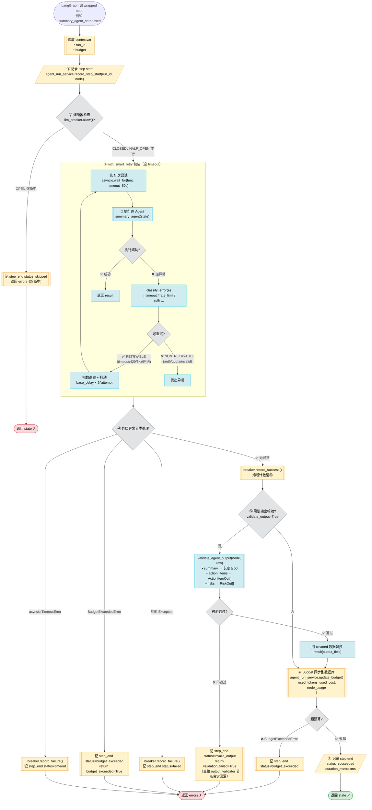
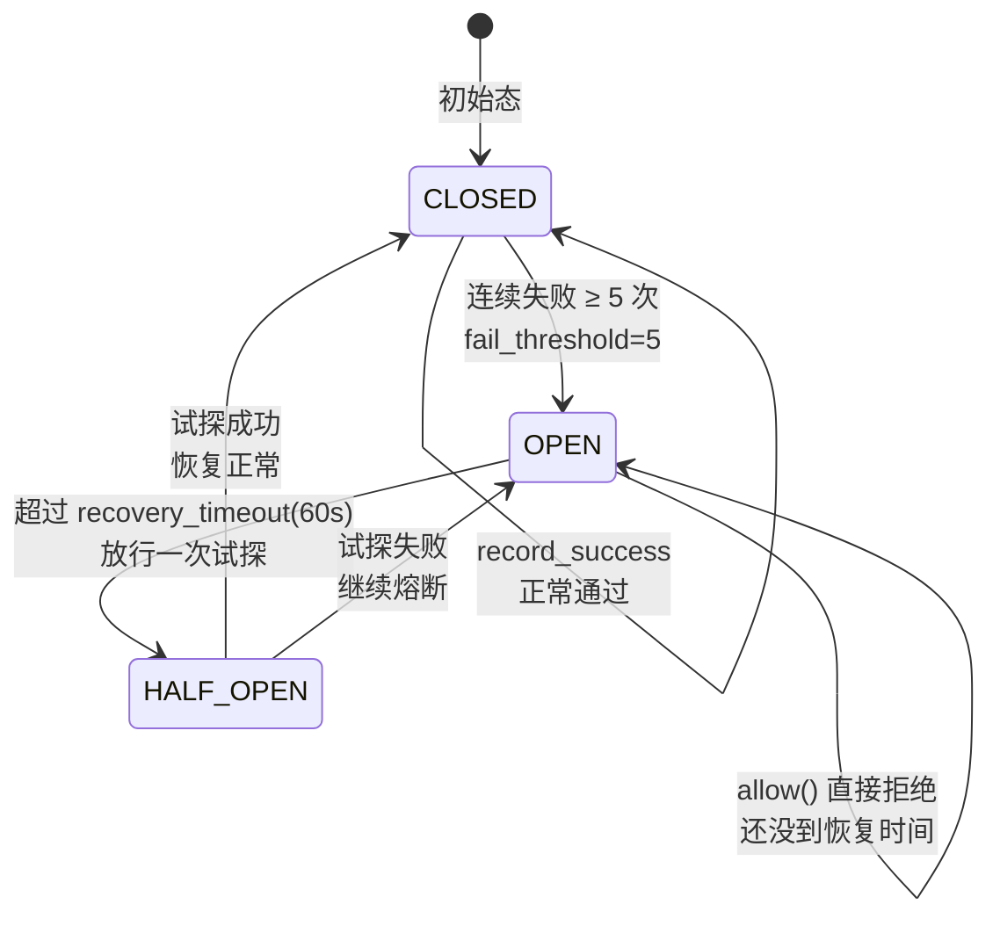
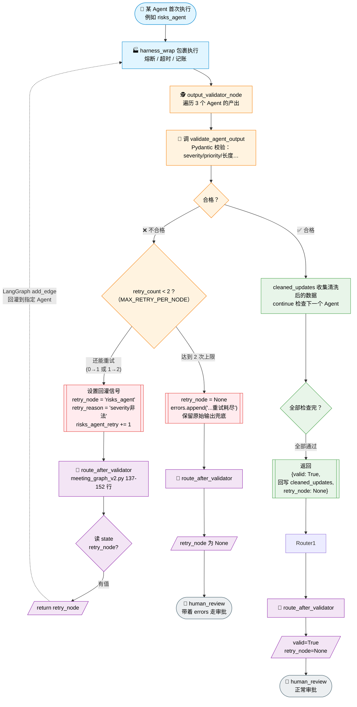
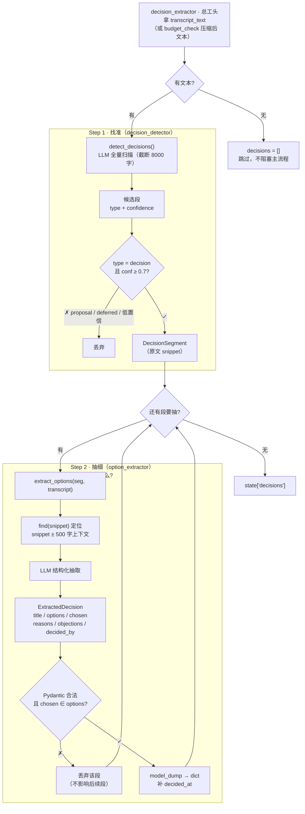
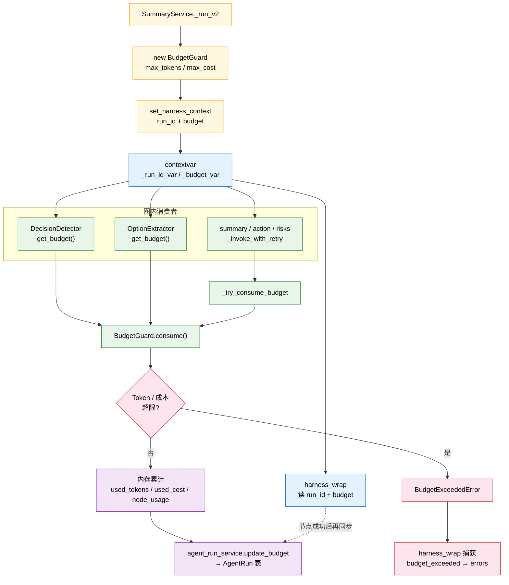
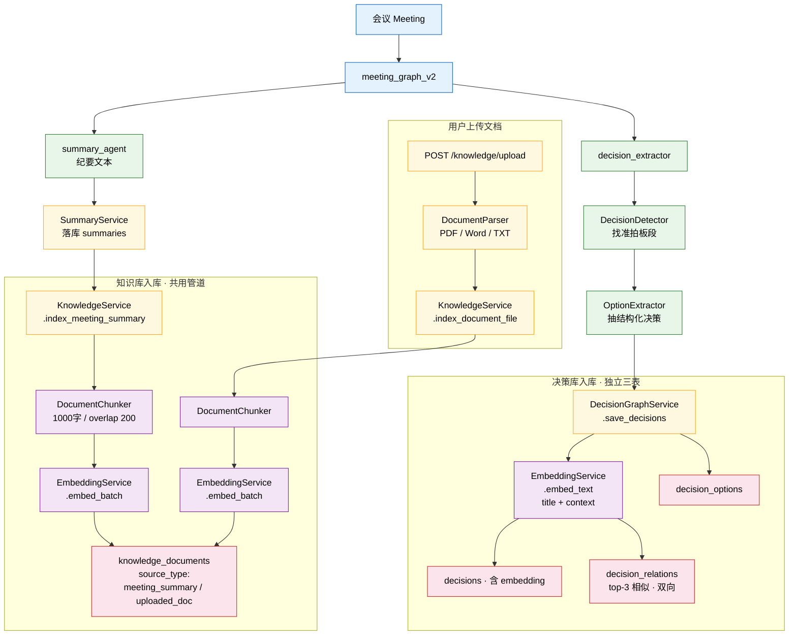
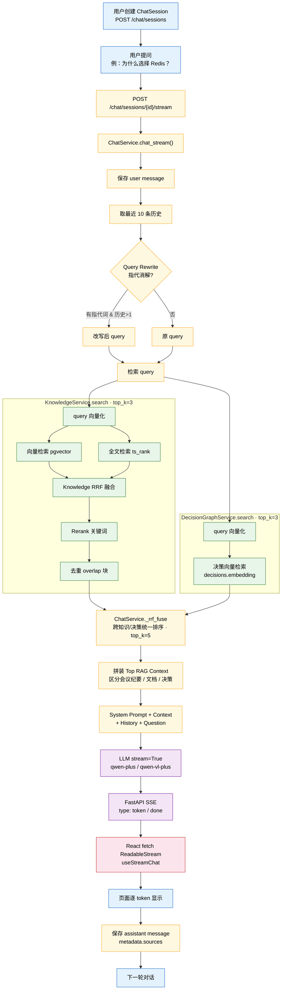
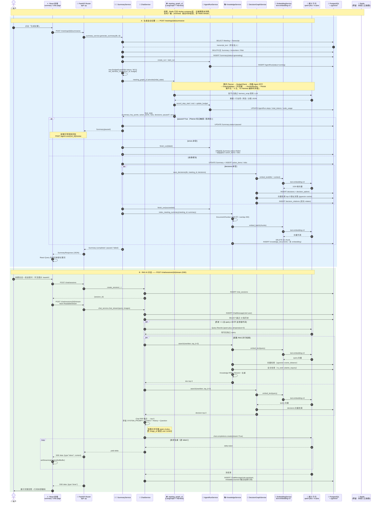

# MeetingAgent流程图

> 文件位置：`backend/app/api/agent_runs.py`
>
> 一句话定位：**Agent 的「运行监控台」**——查看 Agent 跑了多少次、某次跑得怎么样、用了哪些工具、需要人工审核时批准还是拒绝。

---

## 📋 二、接口一览表


| #   | 接口                            | HTTP 方法  | 作用（做什么）                                     | 项目中的定位（谁会用）                                   | 涉及的 Service / 依赖                                   |
| --- | ----------------------------- | -------- | ------------------------------------------- | --------------------------------------------- | -------------------------------------------------- |
| 1   | `/agent-runs`                 | **GET**  | **查列表**：分页查看所有 Agent 运行记录，可按会议 ID、状态过滤      | 「运行记录页」的主列表，管理员/开发者用来看历史跑了哪些任务                | `agent_run_service.list_runs()`                    |
| 2   | `/agent-runs/tools/list`      | **GET**  | **查工具**：列出系统里所有已注册的工具（Tool Registry）        | 前端展示"Agent 能用哪些工具"，比如调 `search`、`summarize` 等 | `app.agents.tools.registry.list_tools()`           |
| 3   | `/agent-runs/stats/overview`  | **GET**  | **查统计**：Dashboard 概览数据——总次数、成功率、Token 消耗、成本 | 首页仪表盘卡片，一眼看到 Agent 整体健康状况                     | 直接查 `AgentRun` 表聚合（`SUM`/`COUNT`）                  |
| 4   | `/agent-runs/{run_id}`        | **GET**  | **查详情**：某一次运行的完整信息（步骤、日志、消耗等）               | 点击列表某条记录，进入详情页展示                              | `agent_run_service.get_run()`                      |
| 5   | `/agent-runs/{run_id}/review` | **POST** | **人工审批**：对需要人工确认的 Run 点「通过」或「拒绝」            | Agent 卡在需要人类批准的步骤时（Human-in-the-loop），审核员操作   | `agent_run_service.approve_run()` / `reject_run()` |


---

## 🔍 三、每个接口再拆细一点（小白版）

### 1. `GET /agent-runs` —— 列表接口

**你会怎么用它：**

```
GET /agent-runs?meeting_id=abc123&status=running&page=1&page_size=20
```

**参数解释：**

- `meeting_id`：只看某场会议的 Agent 运行记录
- `status`：状态筛选，可选值：
  - `pending`（等待中）
  - `running`（运行中）
  - `paused`（暂停，通常是等审批）
  - `succeeded`（成功）
  - `failed`（失败）
  - `cancelled`（已取消）
- `page` / `page_size`：分页

**返回：**

```json
{
  "items": [...],        // 当前页的运行记录数组
  "total": 100,          // 总条数
  "page": 1,
  "page_size": 20
}
```

---

### 2. `GET /agent-runs/tools/list` —— 工具清单

**用途：** 告诉前端"这个 Agent 系统里注册了哪些工具"。
例如：搜索会议纪要、生成摘要、查询知识库……

**返回：**

```json
{ "tools": [ {...}, {...} ] }
```

不需要传参数，任何人都能查。

---

### 3. `GET /agent-runs/stats/overview` —— 统计概览

**用途：** 给 Dashboard 用的一个"体检报告"。

**返回示例：**

```json
{
  "status_counts": {
    "succeeded": 80,
    "failed": 10,
    "running": 5
  },
  "total_runs": 100,
  "total_tokens": 1520000,
  "total_cost_usd": 3.240000,
  "success_rate": 0.8
}
```

**通俗理解：**

- 一共跑了多少次
- 成功多少、失败多少
- 花了多少 Token、多少美元
- 成功率是多少

---

### 4. `GET /agent-runs/{run_id}` —— 详情接口

**你会怎么用它：**

```
GET /agent-runs/run_abc_123
```

**返回：** 这次运行的所有细节（步骤、每一步用了什么工具、耗时、结果……）

**特殊情况：**

- 如果 `run_id` 不存在，返回 `404 Agent Run 不存在`

---

### 5. `POST /agent-runs/{run_id}/review` —— 人工审批

**背景：** 有些 Agent 步骤风险大（比如"发邮件"、"删数据"），系统会**暂停**并等人类点头。

**请求 Body：**

```json
{
  "reviewer": "张三",       // 审核人
  "note": "已确认，可以发",  // 备注（可选）
  "action": "approve"       // 或者 "reject"
}
```

**两种结果：**


| action    | 效果              |
| --------- | --------------- |
| `approve` | ✅ 通过，Agent 继续执行 |
| `reject`  | ❌ 拒绝，Run 直接终止   |


**报错情况：**

- Run 不存在 → `404`
- 已经审批过了（不是 `pending` 状态） → `400`，避免重复操作

---

## 🧩 四、和其他模块的关系


| 依赖对象                | 来自哪里                                | 干什么用的            |
| ------------------- | ----------------------------------- | ---------------- |
| `agent_run_service` | `app/services/agent_run_service.py` | 真正查库、更新状态的地方     |
| `list_tools`        | `app/agents/tools/registry.py`      | 拿到所有注册工具的列表      |
| `AgentRun` 模型       | `app/models/agent_run.py`           | 数据库表的 ORM 定义     |
| `get_db`            | `app/api/deps.py`                   | FastAPI 的数据库会话依赖 |


---

## 💡 五、记忆小贴士

把这个文件想象成**「后台管理系统里的 Agent 运行日志页」**：

- **列表页** → `GET /agent-runs`
- **详情页** → `GET /agent-runs/{run_id}`
- **仪表盘** → `GET /agent-runs/stats/overview`
- **工具库** → `GET /agent-runs/tools/list`
- **审批按钮** → `POST /agent-runs/{run_id}/review`

一共 5 个接口，看起来多，其实就是"**查列表 / 查详情 / 查统计 / 查工具 / 审批**"这五件事。

---

## 🌊 六、附录：`meeting_graph_v2` 工作流全景图

> 文件：`backend/app/agents/meeting_graph_v2.py`
>
> 这是 Agent Run **背后真正在跑的流程**——`agent_runs.py` 只是它的"监控台"。

### 6.1 流程 Mermaid 图（小白版）




### 6.2 图里每个节点做啥（对照源码）


| 节点                   | 源码来源                                           | 通俗解释                                   |
| -------------------- | ---------------------------------------------- | -------------------------------------- |
| `planner`            | `nodes/planner.py`                             | 分析会议类型/敏感度，决定 `plan.should_run_xxx` 开关 |
| `budget_check`       | `nodes/budget_check.py`                        | 检查预算 + 长文本压缩（`transcript_compressed`）  |
| `summary_agent`      | v1 里的老 agent + `harness_wrap`                  | 写摘要                                    |
| `action_items_agent` | v1 里的老 agent + `harness_wrap`                  | 抽行动项                                   |
| `risks_agent`        | v1 里的老 agent + `harness_wrap`                  | 识别风险                                   |
| `decision_extractor` | `nodes/decision_extractor.py` + `harness_wrap` | Q8 新增：抽决策（detect + extract 两步）         |
| `output_validator`   | `nodes/output_validator.py`                    | 校验产出，不合格设 `retry_node` 回灌              |
| `human_review`       | `nodes/human_review.py`                        | 高风险审批闸门                                |
| `persist`            | 本文件内 `persist_node`                            | 只打个"我完事了"的标记                           |


---

## 📦 七、State 全景图：一份"会议表格"跟着流程流动

> 源码：`MeetingAgentStateV2`（`meeting_graph_v2.py` 第 53-89 行）
>
> **State = 一张贴在 Agent 手上的便利贴**，每个节点跑完往上写几笔，下一个节点看着这张便利贴继续干。

### 7.1 State 是什么（拿真实会议举例）

假设用户传了这场会议：

> **会议标题：** 2026 Q3 产品评审会
> **时间：** 2026-08-05 14:00
> **转录文本：** "张三：Q3 我们要上线 AI 助手。李四：担心预算不够。王五：下周三前给方案……"

Agent 跑完之后，这张便利贴长这样：

```text
┌─────────────────────────────────────────────────────────────────┐
│              MeetingAgentStateV2  （便利贴 / 状态表）             │
├─────────────────────────────────────────────────────────────────┤
│  ── 基础字段（v1 就有的） ──                                     │
│  meeting_id:      "mtg_20260805_001"                            │
│  meeting_title:   "2026 Q3 产品评审会"                            │
│  meeting_date:    "2026-08-05T14:00:00"                         │
│  transcript_text: "张三：Q3 我们要上线 AI 助手。李四：..."         │
│                                                                 │
│  ── 各 Agent 产出（跑完才有值） ──                                │
│  summary:         "本次评审确定 Q3 上线 AI 助手…"  ✅             │
│  key_points:      ["Q3 上线 AI 助手", "预算存在缺口", ...]  ✅    │
│  action_items:    [ {...}, {...} ]  ✅（结构见 7.3）              │
│  risks:           [ {...} ]         ✅（结构见 7.3）              │
│  decisions:       [ {...} ]         ✅（Q8 新增）                 │
│  errors:          []                                            │
│                                                                 │
│  ── Harness 控制字段（v2 新增） ──                                │
│  plan:            { "should_run_summary": true, ... }           │
│  transcript_compressed:      true                               │
│  transcript_compressed_text: "张三：上 AI 助手…"（压缩后）        │
│                                                                 │
│  ── 重试计数器 ──                                                │
│  summary_agent_retry:       0                                   │
│  action_items_agent_retry:  1   ← 被 validator 打回重跑过 1 次   │
│  risks_agent_retry:         0                                   │
│                                                                 │
│  ── Validator / Review 信号 ──                                   │
│  valid:                true                                     │
│  retry_node:           null                                     │
│  retry_reason:         null                                     │
│  paused:               false                                    │
│  approved:             true                                     │
│  review_status:        "approved"                               │
│  budget_exceeded:      false                                    │
│  validation_failed:    false                                    │
│                                                                 │
│  ── 给审批页展示用的预览 ──                                       │
│  review_summary_preview:    "本次评审确定 Q3 上线…"（前 200 字）  │
│  review_risks_count:        1                                   │
│  review_action_items_count: 2                                   │
│                                                                 │
│  ── 最后一步 ──                                                  │
│  persisted:            true    ← persist 节点写的                │
└─────────────────────────────────────────────────────────────────┘
```

### 7.2 每个字段是谁写的（跟着流程走）


| 字段                                                            | 谁写进去                                        | 什么时候写               |
| ------------------------------------------------------------- | ------------------------------------------- | ------------------- |
| `meeting_id` / `meeting_title` / `transcript_text`            | **summary_service** 传入                      | 一开始 `initial_state` |
| `plan`                                                        | `planner` 节点                                | 第 1 步               |
| `transcript_compressed(_text)` / `budget_exceeded`            | `budget_check` 节点                           | 第 2 步               |
| `summary` / `key_points`                                      | `summary_agent`                             | 干活时                 |
| `action_items`                                                | `action_items_agent`                        | 干活时                 |
| `risks`                                                       | `risks_agent`                               | 干活时                 |
| `decisions`                                                   | `decision_extractor`                        | 干活时                 |
| `xxx_retry`                                                   | `output_validator` 触发回灌 → 节点自己 +1           | 每次重跑                |
| `valid` / `retry_node` / `retry_reason` / `validation_failed` | `output_validator`                          | 验货后                 |
| `paused` / `review_status` / `review_xxx_preview/count`       | `human_review`                              | 审批闸门                |
| `approved`                                                    | 人工审批（`POST /agent-runs/{run_id}/review`）回灌  | 审完                  |
| `persisted`                                                   | `persist` 节点                                | 收尾                  |
| `errors`                                                      | 任何节点出错都能追加（`Annotated[list, operator.add]`） | 任何时候                |


> **⚠️ 有两个"藏起来的"字段不在 State 里：** `agent_run_id` 和 `budget_guard`——它们通过 Python 的 `contextvar` 传递，避免污染 State（源码第 67 行注释）。

### 7.3 数组字段里长啥样（`ActionItem` / `Risk` / `Decision`）

State 里的 `action_items` / `risks` / `decisions` 是**数组套字典**，每一项的结构如下：

#### 🅰️ `action_items` 数组（行动项）

对应源码 `meeting_graph.py` 的 `ActionItemResult`：

```python
class ActionItemResult(TypedDict):
    title: str                    # 要做啥
    assignee: Optional[str]       # 谁做
    due_date: Optional[str]       # 什么时候前
    priority: str                 # high / medium / low
```

**真实例子：**

```json
"action_items": [
  {
    "title": "输出 AI 助手技术方案",
    "assignee": "王五",
    "due_date": "2026-08-12",
    "priority": "high"
  },
  {
    "title": "重新核算 Q3 预算",
    "assignee": "李四",
    "due_date": "2026-08-10",
    "priority": "medium"
  }
]
```

#### 🅱️ `risks` 数组（风险）

对应源码 `meeting_graph.py` 的 `RiskResult`：

```python
class RiskResult(TypedDict):
    description: str              # 风险是啥
    severity: str                 # high / medium / low
    mitigation: Optional[str]     # 怎么缓解
```

**真实例子：**

```json
"risks": [
  {
    "description": "Q3 预算存在 30% 缺口，可能导致上线延期",
    "severity": "high",
    "mitigation": "李四本周内提交预算调整申请"
  }
]
```

#### 🅲 `decisions` 数组（决策，Q8 新增）

由 `decision_extractor_node` 产出，字段更多（含 `decided_at` = `meeting_date`）：

**真实例子：**

```json
"decisions": [
  {
    "title": "Q3 上线 AI 助手",
    "content": "评审通过 Q3 Roadmap，AI 助手为最高优先级项目",
    "decided_by": ["张三", "李四", "王五"],
    "decided_at": "2026-08-05T14:00:00",
    "impact_level": "high"
  }
]
```

#### 🅳 `plan` 字典（planner 的产出）

```json
"plan": {
  "meeting_type": "product_review",
  "sensitivity": "normal",
  "should_run_summary": true,
  "should_run_actions": true,
  "should_run_risks": true,
  "should_run_decisions": true,
  "reason": "标准产品评审，四路 Agent 全开"
}
```

> `route_after_budget_check` 就是读这个 `plan` 里的 `should_run_xxx`，决定 fan-out 到哪几个 Agent（源码第 118-134 行）。

---

## 🎓 八、串起来记忆

```text
用户传会议
    ↓
summary_service 说"开工！"
    ├─ agent_run_service.create_run()  ← 开一张 Run 单
    └─ meeting_graph_v2.ainvoke(initial_state)  ← 启动流程图
                    ↓
              便利贴 State 开始流动
                    ↓
         planner → budget_check → 4 个 Agent 并行
                    ↓
              output_validator（不合格回灌）
                    ↓
              human_review（高风险等审批）
                    ↓
              persist（打完标）
                    ↓
    summary_service 拿着 final_state 落库到 Meeting/Risk/ActionItem 表
                    ↓
    前端调 GET /agent-runs/{run_id} 查看这张单子的全过程
```

**一图记住三层分工：**


| 层   | 谁                        | 干啥                   |
| --- | ------------------------ | -------------------- |
| 编排层 | `meeting_graph_v2.py`    | 定义流程图 + State 结构     |
| 执行层 | `nodes/*.py` + 4 个 Agent | 真正干活，写便利贴            |
| 记账层 | `agent_run_service.py`   | 全程往 Run 单上记          |
| 监控层 | `agent_runs.py` (本文档主角)  | 暴露 HTTP 接口给前端看 Run 单 |


---

## 🛡️ 九、Harness `harness_wrap()` 完整流程图

> 文件位置：`backend/app/agents/harness/`
>
> 一句话定位：**给每个 Agent 节点套上一层「工业级外壳」**——把"记账 / 熔断 / 超时 / 重试 / 校验 / 预算同步"这些脏活累活全干了，Agent 自己只管写业务。

### 9.1 五大组件是啥


| 组件                   | 文件                   | 一句话作用                        | 通俗理解                      |
| -------------------- | -------------------- | ---------------------------- | ------------------------- |
| **BudgetGuard**      | `budget.py`          | Token / 成本双闸门                | 「还剩多少钱，超了就停」的账房先生         |
| **CircuitBreaker**   | `circuit_breaker.py` | 三态熔断器（CLOSED/OPEN/HALF_OPEN） | 「下游挂了就先别打了，等一会再试探」的保险丝    |
| **with_smart_retry** | `retry.py`           | 错误分类 + 指数退避 + 抖动             | 「网络抖动重试，密码错误不重试」的智能重试     |
| **OutputValidator**  | `validator.py`       | Pydantic 结构校验                | 「Agent 交作业，先检查格式对不对」的批改老师 |
| **harness_wrap**     | `wrap.py`            | 装饰器，把上面 4 个粘一起               | 「一个 `@` 全给你套上」的总装配        |


---

### 9.2 完整调用流程 Mermaid 图（假设 with_smart_retry 已接入 wrap）




---

### 9.3 七步骤对照表（对着源码看）


| #   | 步骤   | 源码位置                                      | 通俗解释                                           |
| --- | ---- | ----------------------------------------- | ---------------------------------------------- |
| ①   | 记账开单 | `wrap.py:84` `_record_step_start`         | 「这一步开始跑了」→ 写进 `AgentRun.steps`                 |
| ②   | 熔断检查 | `wrap.py:87` `llm_breaker.allow()`        | 「下游是不是已经挂了？挂了就跳过省资源」                           |
| ③   | 智能重试 | `retry.py:62` `with_smart_retry`          | 「网络抖动就重试，密码错了别浪费时间」                            |
| ④   | 异常分类 | `wrap.py:103-120` `except ...`            | 「按错误类型走不同的记账通道」                                |
| ⑤   | 输出校验 | `wrap.py:126-145` `validate_agent_output` | 「Agent 交的东西格式对不对？不对就 `validation_failed=True`」 |
| ⑥   | 预算同步 | `wrap.py:149-162` `update_budget`         | 「花了多少钱？写到数据库，超了就中止」                            |
| ⑦   | 记账关单 | `wrap.py:164` `_record_step_end`          | 「这一步跑完了，耗时 XXX ms，状态 succeeded」                |


---

### 9.4 三种"出口"分别是什么状态


| 出口          | 触发条件                          | State 返回                                   | AgentRun step.status |
| ----------- | ----------------------------- | ------------------------------------------ | -------------------- |
| ✅ **正常完成**  | 节点成功 + 校验通过 + 预算未超            | `{summary: "...", ...}`                    | `succeeded`          |
| ✗ **被熔断跳过** | `llm_breaker.state == "open"` | `{errors: [熔断中...]}`                       | `skipped`            |
| ✗ **超时**    | `asyncio.TimeoutError`        | `{errors: [节点 xxx 超时]}`                    | `timeout`            |
| ✗ **预算超限**  | `BudgetExceededError`         | `{errors: [...], budget_exceeded: True}`   | `budget_exceeded`    |
| ✗ **执行异常**  | 其他任意 `Exception`              | `{errors: [执行失败...]}`                      | `failed`             |
| ✗ **校验不合格** | Pydantic 校验挂 / 内容太短           | `{errors: [...], validation_failed: True}` | `invalid_output`     |


---

### 9.5 CircuitBreaker 三态状态机（子图）




**通俗解释：**

- **CLOSED（正常）**：所有请求放行，失败满 5 次跳到 OPEN
- **OPEN（熔断）**：所有请求秒拒，60 秒后跳到 HALF_OPEN
- **HALF_OPEN（试探）**：只放一个请求探路，成功就回 CLOSED，失败就回 OPEN

---

### 9.6 与项目中其它模块的关系

```
    summary_service.py
    ├─ create_run() ────────────→ AgentRun 开单
    ├─ BudgetGuard(run_id=...) ─→ 创建预算管理器
    ├─ set_harness_context() ───→ 塞进 contextvar
    │
    └─ meeting_graph_v2.ainvoke()
              │
              ▼
       每个节点（summary_agent / action_items_agent / ...）
              │
              ▼
       harness_wrap 装饰器接管
              │
              ├─ 读 contextvar（run_id / budget）
              ├─ 调 CircuitBreaker.allow()
              ├─ 调 with_smart_retry(原 Agent)
              ├─ 调 validate_agent_output()
              ├─ 调 agent_run_service.update_budget()
              └─ 调 agent_run_service.record_step_*()
                        │
                        ▼
                  数据库 AgentRun 表
                        │
                        ▼
                  前端 GET /agent-runs/{run_id} 看得到
```

**记忆口诀：**

> **「Harness = 记账 + 保险丝 + 智能重试 + 批改老师 + 账房先生」**
> Agent 自己只管写作文，格式、超时、预算、熔断、记账全部由 `@harness_wrap` 一个装饰器搞定。

---

## 🔁 八、附录：回灌重试（Self-Correction Loop）

> **一句话定位：** 当 Agent 产出的东西**"格式不对/内容不合理"**时，工作流会**自动跳回那个 Agent 让它重做**，最多 2 次。这才是"Agent 会自我纠错"的核心。

### 8.1 涉及的 3 个文件（源码地图）

| 文件 | 角色 | 关键点 |
|---|---|---|
| `nodes/output_validator.py` | 🕵️ **裁判**——判断合不合格 | 调 `validate_agent_output()`，不合格就设 `retry_node` + `retry_reason`，同时把 `xxx_retry` 计数 +1 |
| `meeting_graph_v2.py` 的 `route_after_validator()` | 🚦 **导航员**——决定跳去哪 | 有 `retry_node` → 跳回那个 Agent；没有 → 去 `human_review` |
| `harness/wrap.py` | 🏭 **工人工位**——Agent 被再次执行 | 重跑那个 Agent（Harness 全套：熔断/超时/校验/记账） |

### 8.2 回灌循环 Mermaid 图（小白版）



### 8.3 一场"回灌循环"的真实剧本

假设 `risks_agent` 第一次输出的 `severity` 是 `"严重"`（不是 `high/medium/low`）：

```
第 1 轮：
  risks_agent → 产出 [{severity: "严重"}]
       ↓
  output_validator → Pydantic 校验失败 "severity 非法"
       ↓
  设置 retry_node="risks_agent", risks_agent_retry=1
       ↓
  route_after_validator → return "risks_agent"
       ↓
  LangGraph 跳回 risks_agent（第二次执行）

第 2 轮：
  risks_agent → 又产出 [{severity: "very high"}]（还是错）
       ↓
  output_validator → 校验又失败
       ↓
  设置 retry_node="risks_agent", risks_agent_retry=2
       ↓
  route_after_validator → 又跳回 risks_agent

第 3 轮：
  risks_agent → 假设还是错
       ↓
  output_validator → retry_count(2) >= MAX_RETRY(2)
       ↓
  ❌ 不再回灌！
  errors.append("risks_agent 输出校验失败（重试耗尽）")
  retry_node = None
       ↓
  route_after_validator → 去 human_review（带着 errors）
```

### 8.4 关键代码位置速查

| 想看什么 | 去哪里看 | 行号 |
|---|---|---|
| 重试上限值 `MAX_RETRY_PER_NODE = 2` | `nodes/output_validator.py` | 20 |
| 校验失败设 `retry_node` | `nodes/output_validator.py` | 50-61 |
| 重试耗尽兜底逻辑 | `nodes/output_validator.py` | 63-69 |
| 路由决策（跳回哪个 Agent） | `meeting_graph_v2.py` `route_after_validator` | 137-152 |
| Agent → validator 的边 | `meeting_graph_v2.py` `add_edge` | 190-193 |
| validator → 动态路由 | `meeting_graph_v2.py` `add_conditional_edges` | 196 |
| Pydantic 校验规则 | `harness/validator.py` `ActionItemOut` / `RiskOut` | 14-54 |

### 8.5 「回灌重试」vs「智能重试」（别混淆⚠️）

| 对比 | 回灌重试（本节） | 智能重试（`harness/retry.py`） |
|---|---|---|
| **在哪一层** | **工作流层**——整个 Agent 节点重跑 | **调用层**——一次 LLM 请求内重试 |
| **触发条件** | 输出**格式/内容**不合格 | LLM 调用**报错**（超时/限流/5xx） |
| **上限** | 每个 Agent 2 次（`MAX_RETRY_PER_NODE`） | 3 次（`max_retries=3`） |
| **谁在管** | `output_validator_node` + `route_after_validator` | `with_smart_retry` 函数 |
| **代价** | 重跑整个 Agent（贵，Token 消耗大） | 只重发一次 LLM 请求（便宜） |

> **一句话总结：** 智能重试是"这次网络抽风，我再打一遍电话"；回灌重试是"你写的作业格式不对，回去重写"。

---

## 🎯 九、决策两步流水线图（decision_extractor）

> 文件：`nodes/decision_extractor.py` + `nodes/decision_detector.py` + `nodes/option_extractor.py`
>
> 一句话定位：**决策抽取 = 先"找准"（Step 1 判断是不是拍板），再"抽细"（Step 2 抽取具体内容）**。两步分开，是为了让 LLM 一次只干一件事。



### 9.1 关键点速查

| 关键点 | 位置 | 说明 |
|---|---|---|
| 两步入口编排 | `decision_extractor.py` 41 / 60 | 先 `detect_decisions` 再 `extract_options` |
| 三分类定义 | `decision_detector.py` 26-28 | `decision` / `proposal` / `deferred` |
| 正反例 Prompt | `decision_detector.py` 32-52 | `DETECTOR_PROMPT` |
| 过滤条件 | `decision_detector.py` 104 | `type=="decision" and confidence>=0.7` |
| 前后 500 字上下文 | `option_extractor.py` 97-99 | `idx-500` / `idx+500` |
| chosen 兜底校验 | `option_extractor.py` 148-155 | chosen 不在 options 里就取第一个 |

> **一句话总结：** Step 1 问"这是不是拍板"，只放行"拍板 + 高置信"的段；Step 2 拿到"一段已确认的决策 + 前后 500 字"，专心抽"标题/选项/理由"，不用再纠结"这到底算不算决策"。

---

## 🗺️ 十、端到端总览：从「生成纪要」到落库（全后端主链路）

> 一句话定位：**整个后端基本围着这条链路转**——前端点「生成纪要」→ API → `SummaryService` 备料 → `meeting_graph_v2` 多 Agent 出货 → Service 接住 `final_state` 落库（含决策图谱）。
>
> 对照源码：`api/summaries.py` → `services/summary_service.py` → `agents/meeting_graph_v2.py` → `services/decision_graph_service.py`

### 10.1 Mermaid 总流程图（少字版）

```mermaid
flowchart TD
    UI["前端 · 生成纪要"] --> API["POST /meetings/{id}/summarize"]
    API --> SS["SummaryService.generate_summary"]

    subgraph Prep["① 备料"]
        SS --> M["查 Meeting"]
        M --> T["查 Transcript → 拼文本"]
        T --> Del["删旧 Summary / ActionItem / Risk"]
        Del --> S0["建 Summary status=generating"]
        S0 --> AR["建 AgentRun + start"]
        AR --> BG["建 BudgetGuard + set_harness_context"]
    end

    BG --> P

    subgraph G["② meeting_graph_v2"]
        P["planner"] --> BC["budget_check"]
        BC --> FO{{fan-out · plan 开关}}

        FO --> SA["summary_agent"]
        FO --> AA["action_items_agent"]
        FO --> RA["risks_agent"]
        FO --> DE["decision_extractor"]

        SA --> V["output_validator"]
        AA --> V
        RA --> V
        DE --> V

        V -->|retry_node| SA
        V -->|retry_node| AA
        V -->|retry_node| RA
        V -->|paused| END1([END · 等审批])
        V -->|ok| HR["human_review"]

        HR -->|approved| PS["persist · 仅打标"]
        HR -->|否| END2([END])
        PS --> END3([Graph END])
    end

    END3 --> FS["返回 final_state"]
    END1 --> PAUSED["summary.status = paused"]

    subgraph Persist["③ SummaryService 接住结果"]
        FS --> SUM["summary / key_points → summaries"]
        FS --> AI["action_items → action_items"]
        FS --> RK["risks → risks"]
        FS --> DEC{"decisions?"}
    end

    DEC -->|有| DGS["DecisionGraphService.save_decisions"]
    DEC -->|无| IDX

    subgraph DG["④ 决策图谱"]
        DGS --> EMB["embedding title+context"]
        EMB --> D1["decisions"]
        EMB --> D2["decision_options"]
        EMB --> D3["decision_relations · top-3 相似"]
    end

    D1 --> IDX
    D2 --> IDX
    D3 --> IDX
    IDX["knowledge_service 索引纪要"] --> DONE["status=completed"]

    classDef entry fill:#e3f2fd,stroke:#1565c0,color:#000
    classDef svc fill:#fff8e1,stroke:#f9a825,color:#000
    classDef graph fill:#e8f5e9,stroke:#2e7d32,color:#000
    classDef db fill:#f3e5f5,stroke:#7b1fa2,color:#000
    classDef endn fill:#eceff1,stroke:#546e7a,color:#000

    class UI,API entry
    class SS,DGS,IDX svc
    class P,BC,FO,SA,AA,RA,DE,V,HR,PS graph
    class SUM,AI,RK,D1,D2,D3,EMB db
    class END1,END2,END3,DONE,PAUSED endn
```

### 10.2 和代码怎么对上

| 阶段 | 谁在干 | 关键动作 |
|---|---|---|
| 入口 | `POST .../summarize` | `api/summaries.py` → `summary_service.generate_summary` |
| 备料 | `SummaryService` | 查会 / 拼转写 / 建 `Summary(generating)` / `AgentRun` / `BudgetGuard` |
| 图内 | `meeting_graph_v2` | Planner → Budget → 四路 fan-out → Validator（可回灌）→ HumanReview → Persist（只标 `persisted`） |
| 接结果 | `SummaryService._run_v2_workflow` | 写 `summaries` / `action_items` / `risks`；`paused` 则停；`errors` 则 `failed` |
| 决策 | `DecisionGraphService` | `decisions` + `decision_options` + embedding + `decision_relations`（失败不影响纪要） |
| 收尾 | `knowledge_service` | 成功后把纪要索引进知识库 |

### 10.3 记三条就够

1. **图内 `persist` 不落业务表**——真正写库在 `SummaryService` 拿到 `final_state` 之后。
2. **四路并行**由 `plan.should_run_*` 决定；Validator 只管摘要/行动/风险，决策节点自带 Pydantic。
3. **决策落库独立且可失败**：纪要已成，向量关联挂了也不回滚纪要。


---

## 💰 十一、预算线：BudgetGuard 如何穿过整张图

> 一句话定位：**BudgetGuard 不进 LangGraph State**——`SummaryService` 建好后塞进 `contextvar`，图内任意节点用 `get_budget()` 取出记账；超限抛 `BudgetExceededError`，由 `harness_wrap` 拦住。
>
> 对照源码：`summary_service.py` → `harness/wrap.py` → `harness/budget.py` →（Agent / Detector / Extractor）→ `agent_run_service.update_budget`

### 11.1 Mermaid 预算线（少字版）



### 11.2 为什么用 contextvar（不是 State）

| 做法 | 行不行 | 原因 |
|---|---|---|
| 放进 `MeetingAgentStateV2` | ❌ | `BudgetGuard` 可变；LangGraph 会序列化 / 过滤非 TypedDict 字段 |
| `contextvar` | ✅ | 同一次 `ainvoke` 调用链共享；节点零侵入 `get_budget()` |

### 11.3 两条记账入口（汇到同一 `consume`）

| 入口 | 谁调用 | 怎么记 |
|---|---|---|
| A · LangChain Agent | `meeting_graph._try_consume_budget` | response.`usage_metadata` → `consume(node="llm:模型名")` |
| B · 决策两步 | `decision_detector` / `option_extractor` | OpenAI `resp.usage` → `consume(node=节点名)` |

`consume` 内做两道闸：`used_tokens > max_tokens` 或 `used_cost > max_cost_cny` → 抛错；否则写内存 + 异步刷 `AgentRun`。

### 11.4 记三条就够

1. **注入一次，全图可见**：`set_harness_context` 只在进图前调一次。
2. **记账靠 `get_budget().consume()`**，不是靠 State 字段累加。
3. **超限不重试**：`BudgetExceededError` 直达 `harness_wrap`，节点标 `budget_exceeded`。


---

## 📚 十二、RAG 入库全景：三条数据生产线

> 一句话定位：**纪要 / 上传文档 → `knowledge_documents`；决策 → `decisions` 三表**。共用 `embedding_service`（text-embedding-v3），但存储与检索路径分离。
>
> 对照源码：`summary_service` → `knowledge_service`；`decision_graph_service`；`api/knowledge.py`

### 12.1 Mermaid 入库流程图



### 12.2 三条线速查

| 来源 | 触发 | 入库表 | 备注 |
|---|---|---|---|
| Agent 纪要 | 纪要生成成功后 `index_meeting_summary` | `knowledge_documents` | 先删旧 chunk 再重建 |
| 用户上传 | `POST /knowledge/upload` | `knowledge_documents` | Parser → 同名覆盖 |
| Agent 决策 | `save_decisions` | `decisions` + `options` + `relations` | 不进 `knowledge_documents` |

---

## 💬 十三、RAG AI 对话全景：双路召回 + 流式回答

> 一句话定位：**Query Rewrite → 知识库 + 决策库双路检索 → Chat RRF 融合 → LLM 流式生成 → SSE 推前端**。
>
> 对照源码：`api/chat.py` → `chat_service.py` → `knowledge_service.search` + `decision_graph_service.search`

### 13.1 Mermaid 对话流程图



### 13.2 检索两层 RRF（别混淆）

| 层级 | 在哪 | 融合什么 |
|---|---|---|
| Knowledge RRF | `knowledge_service.search` | 向量检索 + 全文检索 → Rerank → 去重 |
| Chat RRF | `chat_service._rrf_fuse` | 知识库 top-3 + 决策库 top-3 → 统一 top-5 |

### 13.3 记三条就够

1. **决策不进知识库表**，对话时走 `DecisionGraphService.search` 独立召回。
2. **Query Rewrite 有门槛**：历史 > 1 且含指代词、query ≤ 50 字才触发。
3. **sources 随 assistant 消息落库**，前端刷新后可回看引用来源。

---

## 🌐 十四、总体时序图：前端 · 后端 · DB · Redis · RAG · LLM 全链路

> 一句话定位：**一图看穿两条主要用户路径**——「A · 生成会议纪要」和「B · RAG AI 对话」。
> 前端 fetch → FastAPI → Service 分派 → LangGraph 编排 / 双路检索 → PostgreSQL(+pgvector) 落库 → 通义千问 LLM。
>
> **关于 Redis**：`docker-compose.yml` 起了 `redis:7-alpine`，`config.py` 也读了 `REDIS_URL`，但主链路（纪要生成 + 对话）**目前都没有走 Redis**。曾经的实时广播实现（`_archived/realtime_broadcaster.py`）注释里写得很直白："**采用内存直连广播而非 Redis Stream pub/sub，简化 MVP 部署依赖**"。因此下图把 Redis 单独画出来，标注为「预留 · 未接入主链路」，避免误导。

### 14.1 端到端 Sequence Mermaid 图



### 14.2 三条链路速查

| 阶段 | 主要参与者 | 关键库表 | 是否走 LLM |
|---|---|---|---|
| 生成纪要图内 | `meeting_graph_v2` + `harness_wrap` | `agent_runs.steps / tokens` | ✅ 每个 Agent 各一次 |
| 落库（纪要成功后） | `SummaryService` / `DecisionGraphService` / `KnowledgeService` | `summaries` / `action_items` / `risks` / `decisions` / `decision_options` / `decision_relations` / `knowledge_documents` | ✅ 仅 embedding |
| RAG 对话 | `ChatService` + `KnowledgeService` + `DecisionGraphService` | `chat_sessions` / `chat_messages` / `knowledge_documents` / `decisions` | ✅ Rewrite（可选）+ Embedding + 流式生成 |

### 14.3 一定要记住的三件事

1. **Redis 目前只是"docker-compose 里挂着的一份保险"**——主链路不消费。真要上多实例广播，才需要重新拉起 `_archived/realtime_broadcaster.py` 里的 Redis Stream 方案。
2. **图内 `persist` 只做"打标"**——真正写业务表在 `SummaryService` 拿到 `final_state` 之后，决策与知识库索引都属于"图后处理"。
3. **对话是"两路召回 + 两次 RRF"**：`KnowledgeService.search` 里做过一次向量 vs 全文的 RRF；`ChatService._rrf_fuse` 又做了一次知识库 vs 决策库的 RRF——两层别混淆。

---

## 🧬 十五、V2 Harness 多 Agent 编排时序图（补充详图）

> 一句话定位：**把「十四」里"Graph 内部这一大团"拆开看**——`planner → budget_check → route → 4×harness_wrap 并行 → output_validator（可回灌）→ human_review → persist`，把 `contextvar` / `CircuitBreaker` / `BudgetGuard` / `Pydantic Validator` / `AgentRun step 记账` 五件套的先后顺序钉死。
>
> 对照源码：`agents/meeting_graph_v2.py` + `agents/harness/wrap.py` + `agents/harness/{budget,circuit_breaker,validator,retry}.py` + `agents/nodes/*.py`

### 15.1 完整 Sequence Mermaid 图

```mermaid
sequenceDiagram
    autonumber
    participant SS as 🧑‍🍳 SummaryService
    participant Graph as 🕸️ meeting_graph_v2<br/>StateGraph
    participant CV as 🧵 contextvar<br/>run_id + budget
    participant Planner as 🧠 planner_node
    participant Budget as 💰 budget_check_node
    participant Route as 🚦 route_after_<br/>budget_check
    participant Wrap as 🏭 harness_wrap<br/>装饰器
    participant CB as 🔌 CircuitBreaker<br/>llm_breaker
    participant Agent as 🤖 Agent 原函数<br/>summary/action/risks/decision
    participant BG as 🧾 BudgetGuard
    participant Val as 🧪 validator.<br/>validate_agent_output
    participant OV as 🕵️ output_validator_node
    participant HR as 👤 human_review_node
    participant Persist as 💾 persist_node
    participant ARS as 📒 AgentRunService
    participant DB as 🐘 PostgreSQL
    participant LLM as 🤖 通义千问

    SS ->> ARS: create_run + start_run
    ARS ->> DB: INSERT AgentRun(status=running)
    SS ->> CV: set_harness_context(run_id, BudgetGuard)
    SS ->> Graph: ainvoke(initial_state)

    Note over Graph,LLM: ── ① Planner 规划 ──
    Graph ->> Planner: planner_node(state)
    Planner ->> LLM: PLANNER_PROMPT + 转写前 2000 字
    alt LLM 成功且 JSON 合法
        LLM -->> Planner: {meeting_type, should_run_*, needs_human_review, ...}
    else 失败 / 解析失败 / 异常
        Planner ->> Planner: _build_fallback_plan()（按标题关键词兜底）
    end
    Planner ->> ARS: save_plan(run_id, plan)
    ARS ->> DB: UPDATE AgentRun.plan
    Planner -->> Graph: {plan: {...}}

    Note over Graph,LLM: ── ② Budget Check 预算 + 长文压缩 ──
    Graph ->> Budget: budget_check_node(state)
    alt strategy=compressed 且 len > 20k
        Budget ->> LLM: COMPRESS_PROMPT + 全文
        LLM -->> Budget: 地图式摘要（≤30%）
        Budget -->> Graph: {transcript_compressed_text, compressed=True}
    else
        Budget -->> Graph: {compressed=False}
    end

    Note over Graph: ── ③ 动态 fan-out（按 plan.should_run_*）──
    Graph ->> Route: route_after_budget_check(state)
    Route -->> Graph: ["summary_agent", "action_items_agent",<br/>"risks_agent", "decision_extractor"]

    par 并行 · 每路独立走 Harness 七步
        Graph ->> Wrap: summary_agent_harnessed(state)

        Note over Wrap,ARS: 【Harness 七步 · 见 15.2】
        Wrap ->> CV: 读取 run_id / budget
        Wrap ->> ARS: ① record_step_start(node)
        ARS ->> DB: AgentRun.steps.append({running})

        Wrap ->> CB: ② llm_breaker.allow()?
        alt state=OPEN 且未到 recovery_timeout
            CB -->> Wrap: False
            Wrap ->> ARS: record_step_end(status=skipped)
            Wrap -->> Graph: {errors:["熔断中..."]}
        else 放行（CLOSED / HALF_OPEN）
            CB -->> Wrap: True
            Wrap ->> Agent: ③ asyncio.wait_for(agent(state), timeout=60s)

            Agent ->> LLM: SUMMARY / ACTION / RISKS Prompt + transcript
            LLM -->> Agent: markdown / JSON + usage_metadata
            Agent ->> BG: _try_consume_budget(tokens_in, tokens_out)
            BG ->> BG: cost = tokens × 模型定价
            alt used_tokens > max_tokens 或 used_cost > max_cost
                BG -->> Agent: raise BudgetExceededError
                Note right of Agent: 异常上抛到 wrap
            else 未超限
                BG ->> DB: UPDATE AgentRun.total_tokens / node_usage
                BG -->> Agent: 记账完成
            end
            Agent -->> Wrap: result = {summary / action_items / risks / decisions}

            alt ④ 抛 TimeoutError
                Wrap ->> CB: record_failure()
                Wrap ->> ARS: record_step_end(status=timeout)
                Wrap -->> Graph: {errors:["节点 xxx 超时"]}
            else 抛 BudgetExceededError
                Wrap ->> ARS: record_step_end(status=budget_exceeded)
                Wrap -->> Graph: {errors:[...], budget_exceeded:True}
            else 抛其他 Exception
                Wrap ->> CB: record_failure()（连续 5 次→OPEN）
                Wrap ->> ARS: record_step_end(status=failed)
                Wrap -->> Graph: {errors:["执行失败..."]}
            else ✅ 成功
                Wrap ->> CB: record_success()（HALF_OPEN→CLOSED / 计数清零）

                opt ⑤ validate_output=True
                    Wrap ->> Val: validate_agent_output(node, raw)
                    alt Pydantic 通过
                        Val -->> Wrap: (True, cleaned)
                        Wrap ->> Wrap: result[field] = cleaned
                    else 结构 / 长度 / 枚举校验失败
                        Val -->> Wrap: (False, msg)
                        Wrap ->> ARS: record_step_end(status=invalid_output)
                        Wrap -->> Graph: {errors:[...], validation_failed:True}
                    end
                end

                Wrap ->> ARS: ⑥ update_budget(tokens, cost, node_usage)
                ARS ->> DB: UPDATE AgentRun.total_tokens / node_usage
                Wrap ->> ARS: ⑦ record_step_end(status=succeeded, duration_ms)
                ARS ->> DB: 定稿 step 记录
                Wrap -->> Graph: {summary / action_items / risks / decisions}
            end
        end
    and
        Graph ->> Wrap: action_items_agent_harnessed
        Note right of Wrap: 同 Harness 七步<br/>产出 action_items[]
    and
        Graph ->> Wrap: risks_agent_harnessed
        Note right of Wrap: 同 Harness 七步<br/>产出 risks[]
    and
        Graph ->> Wrap: decision_extractor_harnessed
        Note right of Wrap: 两步流水线<br/>Step1 detect_decisions<br/>Step2 extract_options<br/>Pydantic 内部校验，<br/>validate_output=False
    end

    Note over Graph,DB: ── ④ Output Validator 批改作业（不校验 decisions）──
    Graph ->> OV: output_validator_node(state)
    loop 遍历 summary_agent / action_items_agent / risks_agent
        OV ->> Val: validate_agent_output(node, raw)
        alt ✅ 通过
            Val -->> OV: (True, cleaned)
            OV ->> OV: cleaned_updates[field] = cleaned
        else ❌ 校验失败 且 retry_count < 2
            OV ->> OV: retry_count += 1
            OV -->> Graph: {valid:False,<br/>retry_node:"risks_agent",<br/>retry_reason:"severity 非法",<br/>risks_agent_retry: N+1}
        else 💥 重试耗尽（=2）
            OV -->> Graph: {valid:False,<br/>errors:["重试耗尽"],<br/>retry_node:None}
        end
    end
    opt 全部通过
        OV -->> Graph: {valid:True, retry_node:None, ...cleaned_updates}
    end

    Note over Graph: ── ⑤ Router · 分派后续走向 ──
    Graph ->> Graph: route_after_validator(state)
    alt paused=True（human_review 前置暂停）
        Graph -->> SS: 直达 END（工作流暂停等审批）
    else retry_node 非空
        Graph ->> Wrap: 回灌到 retry_node<br/>(最多重跑 2 次，走完整 Harness 七步)
        Note over Wrap,Agent: 计数字段 xxx_retry 已 +1
    else valid=True 或 重试耗尽
        Graph ->> HR: human_review_node(state)
        Note over HR: MVP 阶段：直接放行<br/>{approved:True, review_status:"approved"}
        HR -->> Graph: {approved:True}
    end

    alt approved=True
        Graph ->> Persist: persist_node(state)
        Persist -->> Graph: {persisted:True}
    else 拒绝 / 未通过
        Graph -->> SS: END
    end

    Graph -->> SS: final_state

    Note over SS,DB: ── ⑥ 图后处理：SummaryService 真正落库 ──
    alt paused
        SS ->> DB: UPDATE Summary.status=paused
    else errors
        SS ->> ARS: finish_run(failed)
        SS ->> DB: UPDATE Summary.status=failed + 部分数据兜底
    else 成功
        SS ->> DB: UPDATE Summary(content, key_points, status=completed)
        SS ->> DB: INSERT action_items / risks
        opt decisions 非空
            SS ->> DGS: save_decisions（embedding + top-3 relations，失败不回滚）
        end
        SS ->> ARS: finish_run(succeeded)
        SS ->> KS: index_meeting_summary（Chunk + Embed + pgvector）
    end
```



### 15.2 Harness 七步在源码里的具体行数

| 步骤 | 做什么 | 关键源码 |
|---|---|---|
| ① 开单 | 写 `AgentRun.steps` 一条 `status=running` | `harness/wrap.py:84` `_record_step_start` |
| ② 熔断 | `llm_breaker.allow()`；OPEN 直接跳过 | `harness/wrap.py:87` + `circuit_breaker.py:49` |
| ③ 执行 | `asyncio.wait_for(agent(state), timeout=60s)` | `harness/wrap.py:99-102` |
| ④ 异常分派 | Timeout / BudgetExceeded / 其他 Exception 分三路记账 | `harness/wrap.py:103-120` |
| ⑤ 校验 | `validate_agent_output(name, raw)` Pydantic 结构校验 | `harness/wrap.py:126-145` + `harness/validator.py` |
| ⑥ 记账 | `budget.used_tokens / used_cost / node_usage` 同步到 `AgentRun` | `harness/wrap.py:149-162` |
| ⑦ 关单 | 写 `AgentRun.steps` 补齐 `status=succeeded / duration_ms` | `harness/wrap.py:164` `_record_step_end` |

### 15.3 三处「重试」别混淆

| 层级 | 触发条件 | 上限 | 位置 |
|---|---|---|---|
| LLM 请求内智能重试 | 网络 / 429 / 5xx / 超时 | 3 次（指数退避 + 抖动） | `harness/retry.py:with_smart_retry` |
| **v1** Agent 内旧重试 | 同上 | 3 次 | `meeting_graph.py:_invoke_with_retry` |
| **工作流回灌重试** | Pydantic 校验失败 | 每 Agent 2 次 | `nodes/output_validator.py:MAX_RETRY_PER_NODE` + `route_after_validator` |

> **口诀：** 智能重试是"电话没接通再打一次"；回灌重试是"作业格式不对回去重写"；这两个层是**独立生效**的——一次 Agent 调用可能内部智能重试 3 次，出结果后仍被工作流 validator 打回再跑 2 次。

### 15.4 一份"节点结束时到底往数据库写了什么"清单

| 出口 | AgentRun.steps.status | state 关键字段 | 后续 |
|---|---|---|---|
| ✅ 成功 | `succeeded` | `summary / action_items / ...` | 走 output_validator |
| ⏭️ 熔断跳过 | `skipped` | `errors: ["熔断中..."]` | validator 无产出可校验 |
| ⏰ 超时 | `timeout` | `errors: ["超时"]` | breaker.record_failure 累计 |
| 💸 预算超限 | `budget_exceeded` | `errors, budget_exceeded=True` | 直达图后处理，标 failed |
| 💥 执行异常 | `failed` | `errors: ["执行失败..."]` | breaker.record_failure 累计 |
| ❌ 校验不合格 | `invalid_output` | `errors, validation_failed=True` | output_validator 决定是否回灌 |

### 15.5 一句话总览

> **planner 决定跑哪几个 Agent，budget_check 决定拿全文还是压缩版，`harness_wrap` 把每个 Agent 变成"带记账+熔断+超时+重试+校验"的工业件，`output_validator` 是最后一关质检员——不合格就回灌，最多两次；`human_review` 在 MVP 直接放行，`persist` 只打完事标记，真正落库在 `SummaryService` 手上，决策 + 知识库索引都是"图后处理"。**


