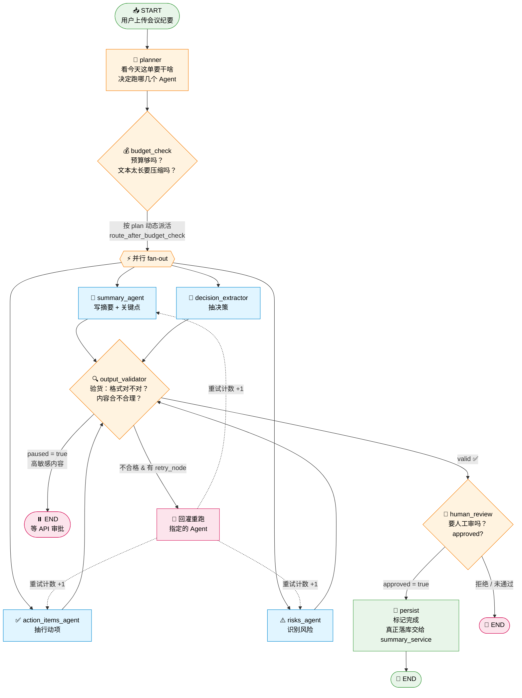

# Agent Runs API 接口说明

> 文件位置：`backend/app/api/agent_runs.py`
>
> 一句话定位：**Agent 的「运行监控台」**——查看 Agent 跑了多少次、某次跑得怎么样、用了哪些工具、需要人工审核时批准还是拒绝。

---

## 📋 二、接口一览表

| # | 接口 | HTTP 方法 | 作用（做什么） | 项目中的定位（谁会用） | 涉及的 Service / 依赖 |
|---|---|---|---|---|---|
| 1 | `/agent-runs` | **GET** | **查列表**：分页查看所有 Agent 运行记录，可按会议 ID、状态过滤 | 「运行记录页」的主列表，管理员/开发者用来看历史跑了哪些任务 | `agent_run_service.list_runs()` |
| 2 | `/agent-runs/tools/list` | **GET** | **查工具**：列出系统里所有已注册的工具（Tool Registry） | 前端展示"Agent 能用哪些工具"，比如调 `search`、`summarize` 等 | `app.agents.tools.registry.list_tools()` |
| 3 | `/agent-runs/stats/overview` | **GET** | **查统计**：Dashboard 概览数据——总次数、成功率、Token 消耗、成本 | 首页仪表盘卡片，一眼看到 Agent 整体健康状况 | 直接查 `AgentRun` 表聚合（`SUM`/`COUNT`） |
| 4 | `/agent-runs/{run_id}` | **GET** | **查详情**：某一次运行的完整信息（步骤、日志、消耗等） | 点击列表某条记录，进入详情页展示 | `agent_run_service.get_run()` |
| 5 | `/agent-runs/{run_id}/review` | **POST** | **人工审批**：对需要人工确认的 Run 点「通过」或「拒绝」 | Agent 卡在需要人类批准的步骤时（Human-in-the-loop），审核员操作 | `agent_run_service.approve_run()` / `reject_run()` |

---

## 🔍 三、每个接口再拆细一点（小白版）

### 1. `GET /agent-runs` —— 列表接口

**你会怎么用它：**

```
GET /agent-runs?meeting_id=abc123&status=running&page=1&page_size=20
```

**参数解释：**

- `meeting_id`：只看某场会议的 Agent 运行记录
- `status`：状态筛选，可选值：
  - `pending`（等待中）
  - `running`（运行中）
  - `paused`（暂停，通常是等审批）
  - `succeeded`（成功）
  - `failed`（失败）
  - `cancelled`（已取消）
- `page` / `page_size`：分页

**返回：**
```json
{
  "items": [...],        // 当前页的运行记录数组
  "total": 100,          // 总条数
  "page": 1,
  "page_size": 20
}
```

---

### 2. `GET /agent-runs/tools/list` —— 工具清单

**用途：** 告诉前端"这个 Agent 系统里注册了哪些工具"。
例如：搜索会议纪要、生成摘要、查询知识库……

**返回：**
```json
{ "tools": [ {...}, {...} ] }
```

不需要传参数，任何人都能查。

---

### 3. `GET /agent-runs/stats/overview` —— 统计概览

**用途：** 给 Dashboard 用的一个"体检报告"。

**返回示例：**
```json
{
  "status_counts": {
    "succeeded": 80,
    "failed": 10,
    "running": 5
  },
  "total_runs": 100,
  "total_tokens": 1520000,
  "total_cost_usd": 3.240000,
  "success_rate": 0.8
}
```

**通俗理解：**
- 一共跑了多少次
- 成功多少、失败多少
- 花了多少 Token、多少美元
- 成功率是多少

---

### 4. `GET /agent-runs/{run_id}` —— 详情接口

**你会怎么用它：**
```
GET /agent-runs/run_abc_123
```

**返回：** 这次运行的所有细节（步骤、每一步用了什么工具、耗时、结果……）

**特殊情况：**
- 如果 `run_id` 不存在，返回 `404 Agent Run 不存在`

---

### 5. `POST /agent-runs/{run_id}/review` —— 人工审批

**背景：** 有些 Agent 步骤风险大（比如"发邮件"、"删数据"），系统会**暂停**并等人类点头。

**请求 Body：**
```json
{
  "reviewer": "张三",       // 审核人
  "note": "已确认，可以发",  // 备注（可选）
  "action": "approve"       // 或者 "reject"
}
```

**两种结果：**
| action | 效果 |
|---|---|
| `approve` | ✅ 通过，Agent 继续执行 |
| `reject` | ❌ 拒绝，Run 直接终止 |

**报错情况：**
- Run 不存在 → `404`
- 已经审批过了（不是 `pending` 状态） → `400`，避免重复操作

---

## 🧩 四、和其他模块的关系

| 依赖对象 | 来自哪里 | 干什么用的 |
|---|---|---|
| `agent_run_service` | `app/services/agent_run_service.py` | 真正查库、更新状态的地方 |
| `list_tools` | `app/agents/tools/registry.py` | 拿到所有注册工具的列表 |
| `AgentRun` 模型 | `app/models/agent_run.py` | 数据库表的 ORM 定义 |
| `get_db` | `app/api/deps.py` | FastAPI 的数据库会话依赖 |

---

## 💡 五、记忆小贴士

把这个文件想象成**「后台管理系统里的 Agent 运行日志页」**：

- **列表页** → `GET /agent-runs`
- **详情页** → `GET /agent-runs/{run_id}`
- **仪表盘** → `GET /agent-runs/stats/overview`
- **工具库** → `GET /agent-runs/tools/list`
- **审批按钮** → `POST /agent-runs/{run_id}/review`

一共 5 个接口，看起来多，其实就是"**查列表 / 查详情 / 查统计 / 查工具 / 审批**"这五件事。

---

## 🌊 六、附录：`meeting_graph_v2` 工作流全景图

> 文件：`backend/app/agents/meeting_graph_v2.py`
>
> 这是 Agent Run **背后真正在跑的流程**——`agent_runs.py` 只是它的"监控台"。

### 6.1 流程 Mermaid 图（小白版）



### 6.2 图里每个节点做啥（对照源码）

| 节点 | 源码来源 | 通俗解释 |
|---|---|---|
| `planner` | `nodes/planner.py` | 分析会议类型/敏感度，决定 `plan.should_run_xxx` 开关 |
| `budget_check` | `nodes/budget_check.py` | 检查预算 + 长文本压缩（`transcript_compressed`） |
| `summary_agent` | v1 里的老 agent + `harness_wrap` | 写摘要 |
| `action_items_agent` | v1 里的老 agent + `harness_wrap` | 抽行动项 |
| `risks_agent` | v1 里的老 agent + `harness_wrap` | 识别风险 |
| `decision_extractor` | `nodes/decision_extractor.py` + `harness_wrap` | Q8 新增：抽决策（detect + extract 两步） |
| `output_validator` | `nodes/output_validator.py` | 校验产出，不合格设 `retry_node` 回灌 |
| `human_review` | `nodes/human_review.py` | 高风险审批闸门 |
| `persist` | 本文件内 `persist_node` | 只打个"我完事了"的标记 |

---

## 📦 七、State 全景图：一份"会议表格"跟着流程流动

> 源码：`MeetingAgentStateV2`（`meeting_graph_v2.py` 第 53-89 行）
>
> **State = 一张贴在 Agent 手上的便利贴**，每个节点跑完往上写几笔，下一个节点看着这张便利贴继续干。

### 7.1 State 是什么（拿真实会议举例）

假设用户传了这场会议：

> **会议标题：** 2026 Q3 产品评审会
> **时间：** 2026-08-05 14:00
> **转录文本：** "张三：Q3 我们要上线 AI 助手。李四：担心预算不够。王五：下周三前给方案……"

Agent 跑完之后，这张便利贴长这样：

```text
┌─────────────────────────────────────────────────────────────────┐
│              MeetingAgentStateV2  （便利贴 / 状态表）             │
├─────────────────────────────────────────────────────────────────┤
│  ── 基础字段（v1 就有的） ──                                     │
│  meeting_id:      "mtg_20260805_001"                            │
│  meeting_title:   "2026 Q3 产品评审会"                            │
│  meeting_date:    "2026-08-05T14:00:00"                         │
│  transcript_text: "张三：Q3 我们要上线 AI 助手。李四：..."         │
│                                                                 │
│  ── 各 Agent 产出（跑完才有值） ──                                │
│  summary:         "本次评审确定 Q3 上线 AI 助手…"  ✅             │
│  key_points:      ["Q3 上线 AI 助手", "预算存在缺口", ...]  ✅    │
│  action_items:    [ {...}, {...} ]  ✅（结构见 7.3）              │
│  risks:           [ {...} ]         ✅（结构见 7.3）              │
│  decisions:       [ {...} ]         ✅（Q8 新增）                 │
│  errors:          []                                            │
│                                                                 │
│  ── Harness 控制字段（v2 新增） ──                                │
│  plan:            { "should_run_summary": true, ... }           │
│  transcript_compressed:      true                               │
│  transcript_compressed_text: "张三：上 AI 助手…"（压缩后）        │
│                                                                 │
│  ── 重试计数器 ──                                                │
│  summary_agent_retry:       0                                   │
│  action_items_agent_retry:  1   ← 被 validator 打回重跑过 1 次   │
│  risks_agent_retry:         0                                   │
│                                                                 │
│  ── Validator / Review 信号 ──                                   │
│  valid:                true                                     │
│  retry_node:           null                                     │
│  retry_reason:         null                                     │
│  paused:               false                                    │
│  approved:             true                                     │
│  review_status:        "approved"                               │
│  budget_exceeded:      false                                    │
│  validation_failed:    false                                    │
│                                                                 │
│  ── 给审批页展示用的预览 ──                                       │
│  review_summary_preview:    "本次评审确定 Q3 上线…"（前 200 字）  │
│  review_risks_count:        1                                   │
│  review_action_items_count: 2                                   │
│                                                                 │
│  ── 最后一步 ──                                                  │
│  persisted:            true    ← persist 节点写的                │
└─────────────────────────────────────────────────────────────────┘
```

### 7.2 每个字段是谁写的（跟着流程走）

| 字段 | 谁写进去 | 什么时候写 |
|---|---|---|
| `meeting_id` / `meeting_title` / `transcript_text` | **summary_service** 传入 | 一开始 `initial_state` |
| `plan` | `planner` 节点 | 第 1 步 |
| `transcript_compressed(_text)` / `budget_exceeded` | `budget_check` 节点 | 第 2 步 |
| `summary` / `key_points` | `summary_agent` | 干活时 |
| `action_items` | `action_items_agent` | 干活时 |
| `risks` | `risks_agent` | 干活时 |
| `decisions` | `decision_extractor` | 干活时 |
| `xxx_retry` | `output_validator` 触发回灌 → 节点自己 +1 | 每次重跑 |
| `valid` / `retry_node` / `retry_reason` / `validation_failed` | `output_validator` | 验货后 |
| `paused` / `review_status` / `review_xxx_preview/count` | `human_review` | 审批闸门 |
| `approved` | 人工审批（`POST /agent-runs/{run_id}/review`）回灌 | 审完 |
| `persisted` | `persist` 节点 | 收尾 |
| `errors` | 任何节点出错都能追加（`Annotated[list, operator.add]`） | 任何时候 |

> **⚠️ 有两个"藏起来的"字段不在 State 里：** `agent_run_id` 和 `budget_guard`——它们通过 Python 的 `contextvar` 传递，避免污染 State（源码第 67 行注释）。

### 7.3 数组字段里长啥样（`ActionItem` / `Risk` / `Decision`）

State 里的 `action_items` / `risks` / `decisions` 是**数组套字典**，每一项的结构如下：

#### 🅰️ `action_items` 数组（行动项）

对应源码 `meeting_graph.py` 的 `ActionItemResult`：

```python
class ActionItemResult(TypedDict):
    title: str                    # 要做啥
    assignee: Optional[str]       # 谁做
    due_date: Optional[str]       # 什么时候前
    priority: str                 # high / medium / low
```

**真实例子：**

```json
"action_items": [
  {
    "title": "输出 AI 助手技术方案",
    "assignee": "王五",
    "due_date": "2026-08-12",
    "priority": "high"
  },
  {
    "title": "重新核算 Q3 预算",
    "assignee": "李四",
    "due_date": "2026-08-10",
    "priority": "medium"
  }
]
```

#### 🅱️ `risks` 数组（风险）

对应源码 `meeting_graph.py` 的 `RiskResult`：

```python
class RiskResult(TypedDict):
    description: str              # 风险是啥
    severity: str                 # high / medium / low
    mitigation: Optional[str]     # 怎么缓解
```

**真实例子：**

```json
"risks": [
  {
    "description": "Q3 预算存在 30% 缺口，可能导致上线延期",
    "severity": "high",
    "mitigation": "李四本周内提交预算调整申请"
  }
]
```

#### 🅲 `decisions` 数组（决策，Q8 新增）

由 `decision_extractor_node` 产出，字段更多（含 `decided_at` = `meeting_date`）：

**真实例子：**

```json
"decisions": [
  {
    "title": "Q3 上线 AI 助手",
    "content": "评审通过 Q3 Roadmap，AI 助手为最高优先级项目",
    "decided_by": ["张三", "李四", "王五"],
    "decided_at": "2026-08-05T14:00:00",
    "impact_level": "high"
  }
]
```

#### 🅳 `plan` 字典（planner 的产出）

```json
"plan": {
  "meeting_type": "product_review",
  "sensitivity": "normal",
  "should_run_summary": true,
  "should_run_actions": true,
  "should_run_risks": true,
  "should_run_decisions": true,
  "reason": "标准产品评审，四路 Agent 全开"
}
```

> `route_after_budget_check` 就是读这个 `plan` 里的 `should_run_xxx`，决定 fan-out 到哪几个 Agent（源码第 118-134 行）。

---

## 🎓 八、串起来记忆

```text
用户传会议
    ↓
summary_service 说"开工！"
    ├─ agent_run_service.create_run()  ← 开一张 Run 单
    └─ meeting_graph_v2.ainvoke(initial_state)  ← 启动流程图
                    ↓
              便利贴 State 开始流动
                    ↓
         planner → budget_check → 4 个 Agent 并行
                    ↓
              output_validator（不合格回灌）
                    ↓
              human_review（高风险等审批）
                    ↓
              persist（打完标）
                    ↓
    summary_service 拿着 final_state 落库到 Meeting/Risk/ActionItem 表
                    ↓
    前端调 GET /agent-runs/{run_id} 查看这张单子的全过程
```

**一图记住三层分工：**

| 层 | 谁 | 干啥 |
|---|---|---|
| 编排层 | `meeting_graph_v2.py` | 定义流程图 + State 结构 |
| 执行层 | `nodes/*.py` + 4 个 Agent | 真正干活，写便利贴 |
| 记账层 | `agent_run_service.py` | 全程往 Run 单上记 |
| 监控层 | `agent_runs.py` (本文档主角) | 暴露 HTTP 接口给前端看 Run 单 |
